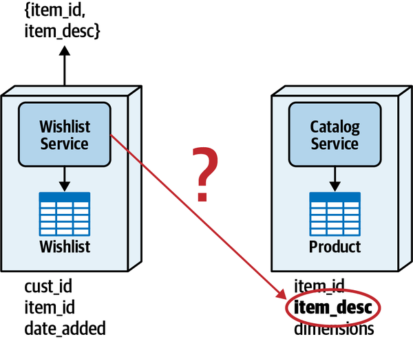
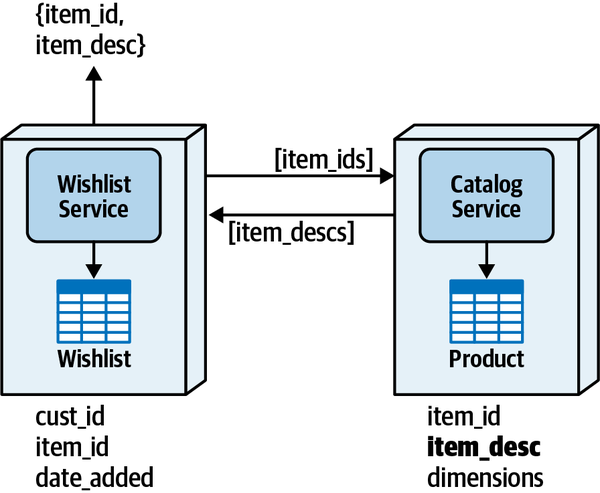
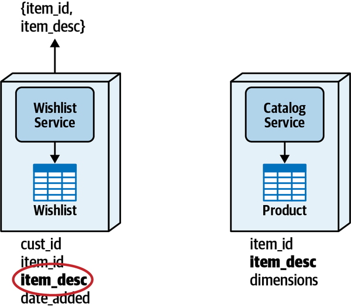
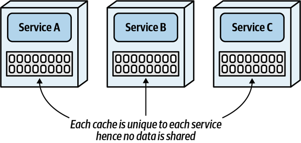
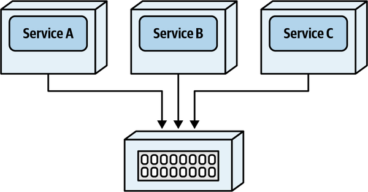
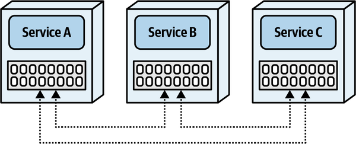
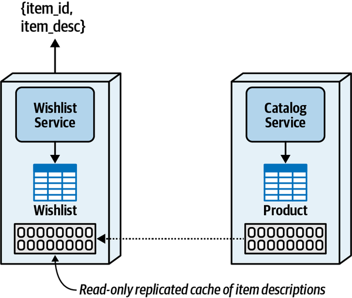
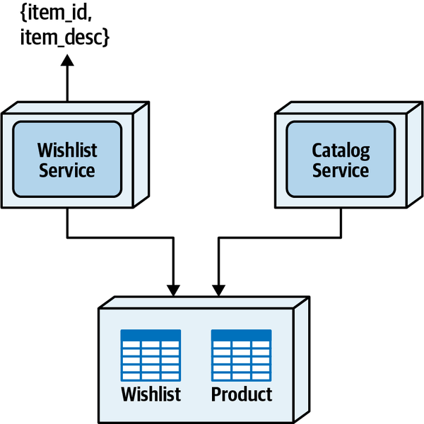

# Chapter 10: Distributed Data Access

This chapter addresses the challenges and solutions for data access in distributed systems, specifically for data not owned directly by the service requiring access.

## Interservice Communication Pattern

- **Description**: This pattern involves direct requests between services using remote access protocols to fetch data.
- **Advantages**: Simplicity in implementation.
- **Disadvantages**: Introduces latency issues (network, security, data), and tightly couples services, affecting scalability and fault tolerance.

## Column Schema Replication Pattern

- **Description**: Data columns are replicated across different services, allowing local access without external requests.
- **Advantages**: Improves data access performance and eliminates direct service dependencies.
- **Disadvantages**: Raises data consistency issues, requires complex synchronization, and challenges data ownership.

## Replicated Caching Pattern

### Caching models

single in-memory:

distributed caching:

replicated caching:

- **Description**: Utilizes in-memory caching that is replicated across services to ensure all services have synchronized, up-to-date data.
- **Advantages**: Enhances responsiveness, fault tolerance, and scalability by providing immediate data access and reducing inter-service dependencies.
- **Disadvantages**: Complex setup, especially in cloud or containerized environments; not suitable for data with high change rates or large volumes.

## Data Domain Pattern

- **Description**: Combines data into a shared schema accessible by all required services, allowing efficient data access through regular SQL operations.
- **Advantages**: Greatly reduces latency and removes service dependencies, maintaining high data consistency and integrity.
- **Disadvantages**: Requires managing a broader bounded context which can complicate data changes and governance; potential security issues with broader data access.
