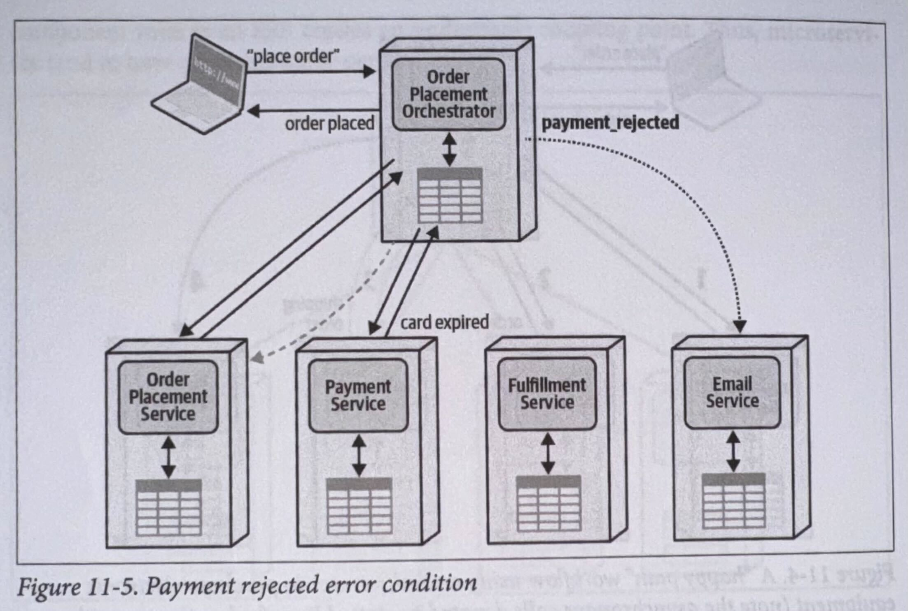
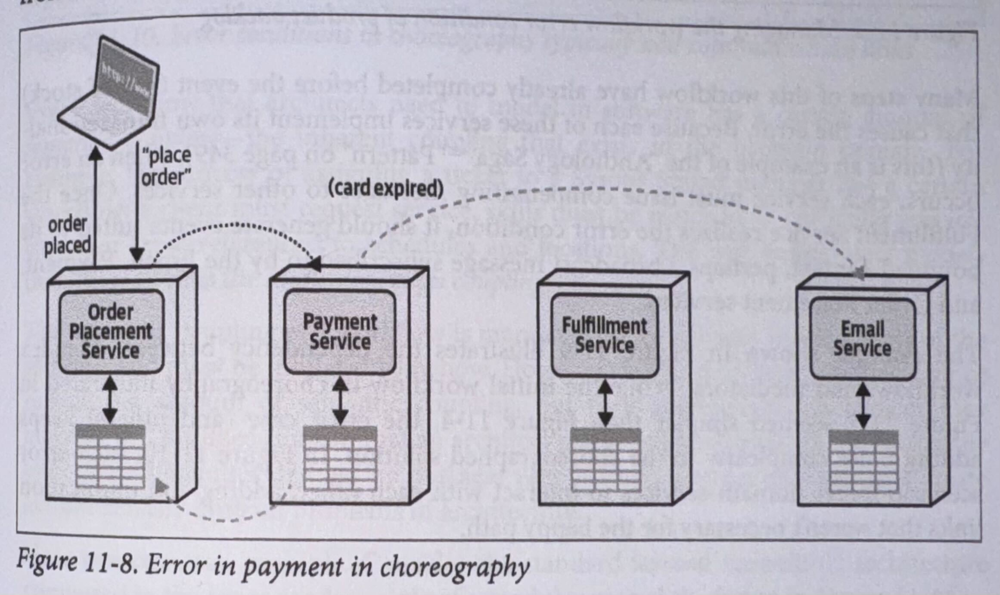

# Chapter 11: Managing Distributed Workflows

  

This chapter addresses the concepts of two communication styles: **orchestration and choreography**. The author emphasizes the need for continuous analysis of trade-offs in distributed architectures and highlights the importance of understanding the forces at play to perform an objective trade-off analysis.

  

In the image below, three coupling forces are illustrated, showing the interactions and dependencies within distributed architectures: communication, consistency, and coordination.

  

  

Coordination: combining two or more services in a distributed architecture to perform domain-specific work, along with the associated issues. There are two fundamental coordination patterns in distributed architectures: orchestration and choreography. The main difference between the two is that orchestration uses an orchestrator, while a choreographed solution does not.

  

  

## Orchestration

  

  

Orchestration uses an orchestrator to manage workflow, error handling, and notifications, similar to a conductor in an orchestra. Each workflow in a microservices architecture typically has its own orchestrator to avoid coupling, unlike a global orchestrator such as an enterprise service bus (ESB).

  

To simplify understanding, we first analyze the "happy path." For example, in an online order system, an Order Placement Orchestrator handles the sequence of placing an order, processing payment, fulfilling the order, and sending a confirmation email, using synchronous and asynchronous calls as needed.

  

  

Understanding the orchestration pattern involves recognizing the primary workflow and how it manages various conditions and alternate paths, not just the straightforward "happy path."

  

Consider two potential error scenarios for electronics purchasing.

  

- What happens if the customer's payment method is rejected?

  

- What happens when the Fufillment Service reports a back order?

  

#### Trade-Offs:

  

  

Advantages of orchestration include centralized workflow management, enhanced error handling, recoverability through state monitoring, and efficient state management. However, disadvantages include potential responsiveness issues due to a communication bottleneck, fault tolerance challenges creating a single point of failure, limited scalability compared to choreography, and increased service coupling.

## Choreography:

The choreography communication style contrasts with orchestration by emphasizing decentralized coordination. In this pattern, each service interacts directly with others, akin to dance partners following a pre-planned routine without a central coordinator. Unlike orchestration, there is no central orchestrator managing the workflow. Instead, services communicate asynchronously, passing messages to trigger actions. While choreography may seem simpler with fewer components, challenges arise with boundary and error conditions, typical in software architecture.

Error in payment in choreography

  
Managing the workflow error condition of product backlog

Error conditions in choreography typically add communication links

Every workflow that architects need to model in software has a certain amount of semantic coupling-the inherent coupling that exists in the problem domain.  

The semantic coupling of a workflow is mandated by the domain requirements of the solution and must be modeled somehow. However clever an architect is, they cannot reduce the amount of semantic coupling, but their implementation choices may increase it.

Consider the standard layered monolithic architecture compared to the more modern style of a modular monolith.

The architecture on the left represents the traditional layered architecture, separated by technical capabilities such as persistence, business rules, and so on. On the right, the same solution appears, but separated by domain concerns such as Catalog Check out and Update Inventory rather than technical capabilities.

Catalog Checkout is "smeared" across the layers of the technical architecture, whereas it appears only in the matching domain component and database in the domain partitioned example.

No matter what, if an architect wants to model a workflow, they must make those moving parts work together. If the architect has organized their architecture the same as the domains, the implementation of the workflow should have similar complexity. However, if the architect has imposed additional layers (as in technical partitioning, shown in Figure 11-12), it increases the overall implementation complexity because now the architect must design for the semantic complexity along with the additional implementation complexity.

### An architect can never reduce semantic coupling via implementation, but they can make it worse.

#### Workflow State Management
While in orchestrated solutions, the orchestrator typically owns the workflow state, in choreography, there's no clear owner.

**1.  Front Controller Pattern:**

 - Assigns state responsibility to the first service in the chain, like the Order Placement Service.
 - Simplifies workflow but increases communication overhead and complexity.
 - Trade-offs include advantages and disadvantages, detailed in Table 11-2.
    

  

**2.  Stateless Choreography:**
- Manages transactional state without storing transient workflow state.
- Relies on querying individual services for real-time snapshots, increasing network overhead.
- Offers flexibility but can be complex and costly in terms of scalability and performance.
- Balances high performance with workflow control, outlined in Table 11-3.  
      

  

**3.  Stamp Coupling:**
  - Stores extra workflow state in message contracts between services.
  - Each domain service updates part of the overall state and passes it along the chain.
  - Provides additional context to services but lacks a single place for users to query workflow state.
  - Features both advantages and drawbacks, summarized in Table 11-4.
 

#### Trade-Offs:
Choreography communication style offers advantages like enhanced responsiveness, scalability, fault tolerance, and service decoupling. However, it poses challenges such as distributed workflow management, lack of centralized state management, complex error handling, and reduced recoverability without an orchestrator.

### Trade-Offs Between Orchestration and Choreography

In software architecture, orchestration and choreography each have their own strengths and weaknesses, leading architects to choose between them based on various factors.

Orchestration typically involves a formal mediator managing state, while choreography relies on distributed ownership, resulting in higher communication between services. The choice between them depends on factors like workflow complexity, scalability, and error handling requirements.

Choreography is suitable for responsive and scalable workflows with fewer error scenarios, but can lead to complexity in certain cases. Orchestration is best for managing complex workflows with boundary and error conditions, trading off some scalability for reduced complexity.

Ultimately, the decision between orchestration and choreography is crucial in microservices architecture, impacting factors like throughput, scalability, and complexity.

  

### Sysops Squad Saga: Managing Workflows

Primary ticket flow modeled as choreography

Primary ticket workflow modeled as orchestration

Final trade-offs between orchestration and choreography for ticket workflow

**ADR: Use Orchestration for Primary Ticket Workflow**  
**Context**  
For the primary ticket workflow, the architecture must support easy tracking of lost or mis-tracked messages, excellent error handling, and the ability to track ticket status. Either an orchestration solution illustrated in Figure 11-16 or a choreography solution illustrated in Figure 11-15 will work.  

**Decision**  
We will use orchestration for the primary ticketing workflow.  
We modeled orchestration and choreography and arrived at the trade-offs in Table 11-8.  

**Consequences**  
Ticketing workflow might have scalability issues around a single orchestrator, which should be reconsidered if current scalability requirements change.
