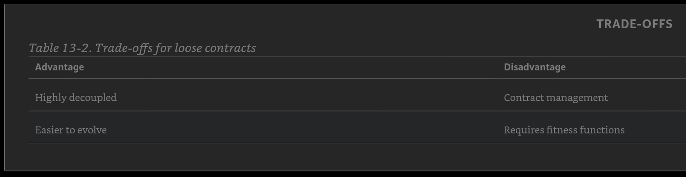
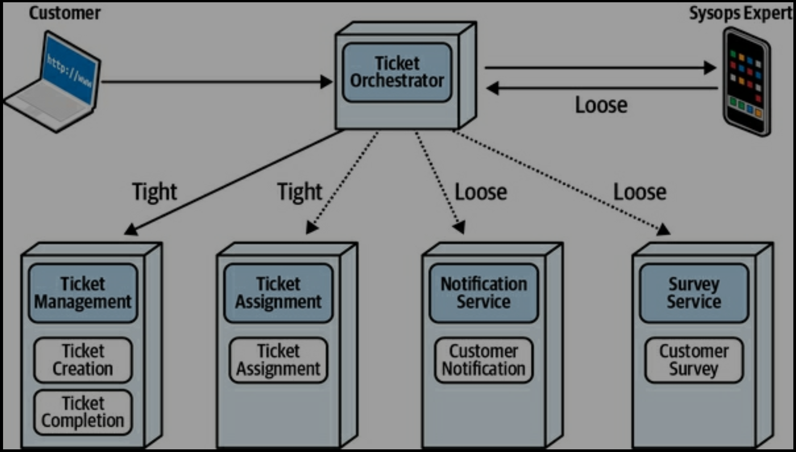

# Contracts

...some forces cut across the conceptual space and affect all of the other dimensions equally. If pursuing the visual three-dimensional metaphor, these cross-cutting forces act as an additional dimension, much as time is orthogonal to the three physical dimensions.

(Hard parts) Contract: The format used by parts of an architecture to convey information or dependencies.

### Strict Versus Loose Contracts

A strict contract requires adherence to names, types, ordering, and all other details, leaving no ambiguity.

Many architects like strict contracts because they model the identical semantic behavior of internal method calls. However, strict contracts create brittleness in integration architecture—something to avoid. As discussed in Chapter 8, something that is simultaneously changing frequently and used by several distinct architecture parts creates problems in architecture.

A common anti-pattern that some architects fall victim to is to assume that Wishlist might eventually need all the other parts, so the architects include them in the contract from the outset. This is an example of stamp coupling and an anti-pattern in most cases, because it introduces breaking changes where they aren’t needed, making the architecture fragile yet providing little benefit.

At the far end of the spectrum of contract coupling lie extremely loose contracts, often expressed as name-value pairs in formats like YAML or JSON, as illustrated in Example 13-4.

Nothing but the raw facts in this example! No additional metadata, type information, or anything else, just name-value pairs. Using such loose contracts allows for extremely decoupled systems, often one of the goals in architectures, such as microservices. However, the looseness of the contract comes with trade-offs such as lack of contract certainty, verification, and increased application logic.

### Trade-Offs Between Strict and Loose Contracts

The replication technique is a good approach when developers have simple static code (like annotations, attributes, simple common utilities, and so on) that is either a one-off class or code that is unlikely to ever change because of defects or functional changes.

## Contracts in Microservices 

Architects must constantly make decisions about how services interact with one another, what information to pass (the semantics), how to pass it (the implementation), and how tightly to couple the services. 
Coupling levels Consider two microservices with independent transactionality that must share domain information such as Customer Address, shown in Figure 13-3.

The architect could implement both services in the same technology stack and use a strictly typed contract, either a platform-specific remote procedure protocol (such as RMI) or an implementation-independent one like gRPC, and pass the customer information from one to another with high confidence of contract fidelity. However, this tight coupling violates one of the aspirational goals of microservices architectures, where architects try to create decoupled services.

Consider the alternative approach, where each service has its own internal representation of Customer, and the integration uses name-value pairs to pass information from one service to another, as illustrated in Figure 13-4. Here, each service has its own bounded-context definition of Customer. When passing information, the architect utilizes name-value pairs in JSON to pass the relevant information in a loose contract.

This loose coupling satisfies many of the overarching goals of microservices. First, it creates highly decoupled services modeled after bounded contexts, allowing each team to evolve internal representations as aggressively as needed. Second, it creates implementation decoupling. If both services start in the same technology stack, but the team in the second decides to move to another platform, it likely won’t affect the first service at all. All platforms in common use can produce and consume name-value pairs, making them the lingua franca of integration architecture.

The biggest downside of loose contracts is contract fidelity—as an architect, how can I know that developers pass the correct number and type of parameters for integration calls? Some protocols, such as JSON, include schema tools to allow architects to overlay loose contracts with more metadata. Architects can also use a style of architect fitness function called a consumer-driven contract.

### Consumer-driven contracts

In many architecture integration scenarios, a service decides what information to emit to other integration partners (a push model—the service provider pushes a contract to consumers). The concept of a consumer-driven contract inverses that relationship into a pull model; here, the consumer puts together a contract for the items they need from the provider, and passes the contract to the provider, who includes it in their build and keeps the contract test green at all times. The contract encapsulates the information the consumer needs from the provider. This may work for a network of interlocking requests that the Provider must honor, as illustrated in Figure 13-5.

Consumer-driven contracts are quite common in microservices architecture because they allow architects to solve the dual problems of loose coupling and governed integration.

Architects often look for a single mechanism to solve problems, and many of the schema tools have elaborate capabilities to create end-to-end connectivity. However, sometimes two simple interlocking mechanisms can solve the problem more simply. Thus, many architects use the combination of name-value pairs and consumer-driven contracts to validate contracts. However, this means that teams require two mechanisms rather than one. The architect’s best solution for this trade-off comes down to team maturity and decoupling with loose contracts versus complexity plus certainty with stricter contracts.

### Stamp Coupling

A common pattern and sometimes anti-pattern in distributed architectures is stamp coupling, which describes passing a large data structure between services, but each service interacts with only a small part of the data structure.

Stamp coupling, however, is often an accidental anti-pattern, where an architect has over-specified the details in a contract that aren’t needed or accidentally consumes far too much bandwidth for mundane calls.

### Over-Coupling via Stamp Coupling

Going back to our Wishlist and Profile Services, consider tying the two together with a strict contract combined with stamp coupling, as illustrated in Figure 13-7. In this example, even though the Wishlist Service needs only the name (accessed via a unique ID), the architect has coupled Profile’s entire data structure as the contract, perhaps in a misguided effort for future proofing. However, the negative side effect of too much coupling in contracts is brittleness. If Profile changes a field that Wishlist doesn’t care about, such as state, it still breaks the contract.

### Bandwidth 

The other inadvertent anti-pattern that some architects fall into is one of the famous fallacies of distributed computing: bandwidth is infinite. Architects and developers rarely have to consider the cumulative size of the number of method calls they make within a monolith because natural barriers exist. However, many of those barriers disappear in distributed architectures, inadvertently creating problems. Consider the previous example for 2,000 requests per second. If each payload is 500 KB, then the bandwidth required for this single request equals 1,000,000 KB per second! This is obviously an egregious use of bandwidth for no good reason. Alternatively, if the coupling between Wishlist and Profile contained only the necessary information, name, the overhead changes to 200 bytes per second, for a perfectly reasonable 400 KB. Stamp coupling can create problems when overused, including issues caused by coupling too tightly to bandwidth. However, like all things in architecture, it has beneficial uses as well.

### Stamp Coupling for Workflow Management
In Chapter 12, we covered a number of dynamic quantum communication patterns, including several that featured the coordination style of choreography. Architects tend toward mediation for complex workflows for the many reasons we’ve delineated. However, what if other factors, such as scalability, drive an architect toward a solution that is both choreographed and complex? Architects can use stamp coupling to manage the workflow state between services, passing both domain knowledge and workflow state as part of the contract, as illustrated in Figure 13-8.

In this example, an architect designs the contract to include workflow information: status of the workflow, transactional state, and so on. As each domain service accepts the contract, it updates its portion of the contract and state for the workflow, then passes it along. At the end of the workflow, the receiver can query the contract to determine success or failure, along with status and information such as error messages. If the system needs to implement transactional consistency throughout, then domain services should rebroadcast the contract to previously visited services to restore atomic consistency.

Using stamp coupling to manage workflow does create higher coupling between services than nominal, but the semantic coupling must go somewhere—remember, an architect cannot reduce semantic coupling via implementation. However, in many cases, switching to choreography can improve throughput and scalability, making the choice of stamp coupling over mediation an attractive one. Table 13-4 shows the trade-offs for stamp coupling.

### Sysops Squad Saga: Managing Ticketing Contracts

