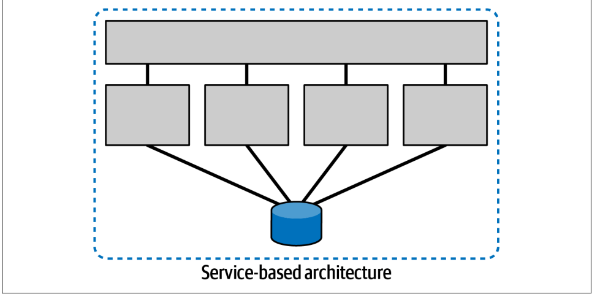
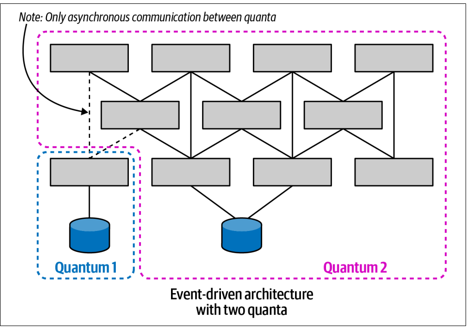
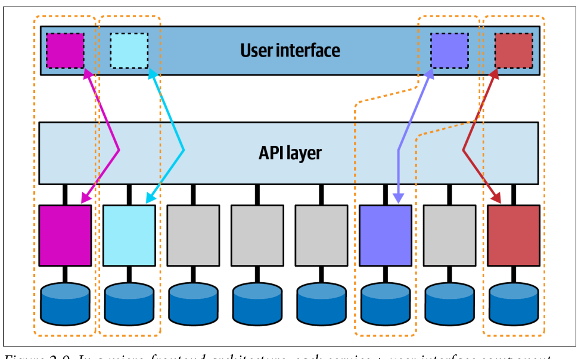
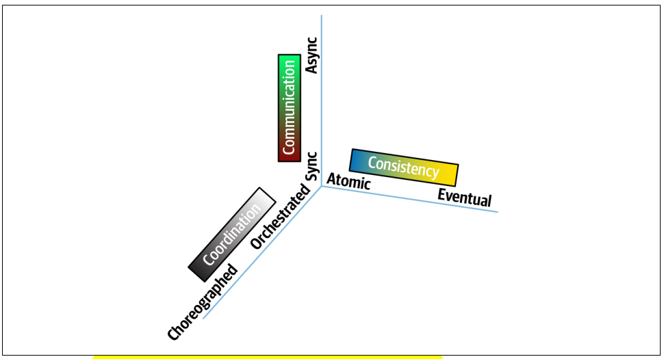

# Chapter 2 - Discerning Coupling in Software Architecture

Architects design fine-grained microservices to achieve decoupling, but then orchestration, transactionality, and asynchronicity become huge problems. Generic advice says “decouple,” but provides no guidelines for how to achieve that goal while still constructing useful systems.

Given that scenario, architects struggle with performing trade-off analysis. Thus, the first step in trade-off analysis is untangle the dimensions of the problem, analyzing what parts are coupled to one another and what impact that coupling has on change. By *coupling*, the authors mean "Two parts of a software system are coupled if a change in one might cause a change in the other".

Still about that, the authors start the journey of untangling of forces in distributed architectures defining architecture quantum along with two types of coupling: static and dynamic.

## Architecture Quantum
First of all, to bring more historic context, _Quantum_ originated from the Latin word _quantus_, meaning “how great” or “how
many.”. With that, An architecture _quantum_ is an independently deployable artifact with high functional cohesion, high static coupling, and synchronous dynamic coupling. A common example of an architecture quantum is a well-formed microservice within a workflow.

## Static Coupling
Represents how static dependencies resolve within the architecture via contracts. These dependencies include operating system, frameworks, and/or libraries delivered via transitive dependency management, and any other operational requirement to allow the quantum to operate.

## Dynamic Coupling
Represents how quanta communicate at runtime, either synchronously or asynchronously.

## Static x Dynamic Coupling
An easy way to think abouyt the diff between Static and Dynamic Coupling is that STATIC describes how services are _wired_ together, whereas dynamic describes how services _call_ one another at runtime. For example, in a microservicesarchitecture, a service must contain dependent components such as a database, representing static coupling—the service isn’t operational without the necessary data. That service may call other services during the course of a workflow, which represents dynamic coupling.

When talking about Static and Dynamic Coupling, we need to highlight some important characteristics, such as Independently Deployable, High Functional Cohesion and High Static Coupling.

## Independently Deployable
Independently deployable implies several aspects of an architecture quantum—each quantum represents a separate deployable unit within a particular architecture. For instance, a monolithic architecture is by definition a single architecture quantum, while a service within microservice architecture represents an architecture quantum.

Also, independent deployability forces the architecture quantum to include common coupling points such as databases. Any system that uses a shared database fails the architecture quantum criteria for independent deployment unless the database deployment is in lockstep with the application.

## High Functional Cohesion
High functional cohesion refers structurally to the proximity of related elements: classes, components, services, and so on. Ideally, in a microservices architecture, each service models a single domain or workflow, and therefore exhibits high functional cohesion.

## High Static Coupling
High static coupling implies that the elements inside the architecture quantum are tightly wired together, which is really an aspect of contracts. An architecture quantum is, in part, a measure of static coupling, and the measure is quite simple for most architecture topologies.

As a mean of demonstration, we have the following image that illustrates individual services with a fine level of isolation. Even though, this architecture renders quantum score to one due to its utilization of a single relational database.

It's important to mention that the previous image represents a Service-Based Architecture which is based on a specific hybrid architecture style that follows a distributed macro-layered structure consisting of a separately deployed user interface, separately deployed remote coarse-grained services, and a monolithic database. This type of architecture is very common when restructuring monolithic architectures.

The static coupling measure of an architecture quantum assesses the coupling dependencies between architectural and operational components. Thus, the operating system, data store, message broker, container orchestration, and all other operational dependencies form the static coupling points of an architecture quantum.

What about an architecture with more than one quanta? We can check it below with an event-driven architecture with two data stores and no static dependency between the sets of services.

High degrees of decoupling allow teams working on a service to move as quickly as possible, without worrying about breaking other dependencies. However, if a system is tightly coupled to a user interface, the architecture forms a single architecture quantum. One trend of architecture that doesn't create coupling between front and back is to use micro frontend frameworks. In this way, user interface elements that interact on behalf of the services are emitted from the services themselves, as shown below.

## Dynamic Quantum Coupling
Dynamic Coupling concerns synchronous coupling at runtime, the behavior of architecture quanta as they interact with one another to form workflows within a distributed architecture. The nature of how services call one another can be represented by three interlocking forces:

### Communication
Refers to the type of connection synchronicity used: synchronous or
asynchronous.

#### Synchronous
The calling service makes a call and blocks until the receiver returns a value.

#### Asynchronous
The caller posts a message to the receiver and, once the caller gets acknowledgement that the message will be processed, it returns to work.

### Consistency
Describes whether the workflow communication requires atomicity or can utilize
eventual consistency. 

### Coordination
Describes whether the workflow utilizes an orchestrator or whether the services
communicate via choreography.