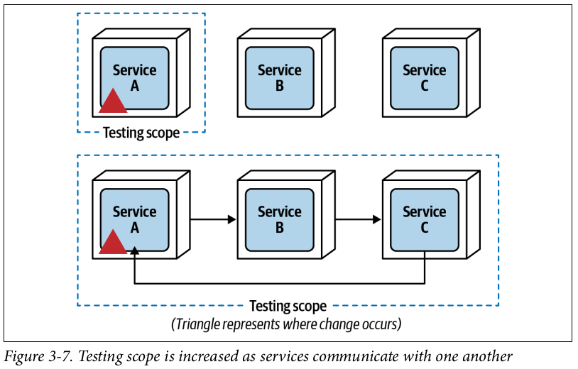

# Chapter 3 - Architectural Modularity

Businesses today face a torrent of change; market evolution seems to keep accelerating at a blistering pace. Business drivers (such as mergers and acquisitions), increased competition in the marketplace, increased consumer demand, and increased innovation (such as automation through machine learning and artificial intelligence) necessarily require changes to underlying computer systems. In many cases, those changes in computer systems consequently necessitate changes to the underlying architectures supporting them

However, it’s not only business that’s undergoing constant and rapid change it’s also the technical environment in which those computer systems reside. Containerization, the move to cloud-based infrastructure, the adoption of DevOps, and even new advancements in continuous delivery pipelines all impact the underlying architecture of those computer systems.

It’s difficult in today’s world to manage all of this constant and rapid change with respect to software architecture.

When one company acquires another, not only does it acquire the physical aspects of a company (such as people, buildings, inventory, and so on) but also more customers

Large monolithic (single deployment) systems generally do not provide the level of scalability, agility, and extensibility required to support most mergers and acquisitions.

The capacity for additional machine resources (threads, memory, and CPU) fills up very quickly. To illustrate this point, consider the water glass shown in Figure. Adding another glass (represented as another server or virtual machine) does nothing, because the
new glass would contain the same amount of water as the first one.

One aspect of architectural modularity is breaking large monolithic applications into separate and smaller parts to provide more capacity for further scalability and growth, while at the same time facilitating constant and rapid change. In turn, these capabilities can help achieve a company’s strategic goals.

By adding another empty glass to our water glass example and breaking the water (application) into two separate parts, half the water can now be poured into the new empty glass, providing 50% more capacity, as shown in Figure.

Increased scalability is only one benefit of architectural modularity. Another important benefit is agility, the ability to respond quickly to change.

## Modularity Drivers

Architects shouldn’t break a system into smaller parts unless clear business drivers exist. The primary business drivers for breaking applications into smaller parts include speed-to-market (sometimes called time-to-market) and achieving a level of competitive advantage in the marketplace.

Fault tolerance, the ability of an application to fail and continue to operate, is necessary to ensure that as parts of the application fail, other parts are still able to function as normal, minimizing the overall impact to the end user.

### Maintainability

Maintainability is about the ease of adding, changing, or removing features, as well as applying internal changes such as maintenance patches, framework upgrades, third-party upgrades, and so on.

Within the context of architecture, we are defining a component as an architectural building block of the application that does some sort of business or infrastructure function.

Large monolithic architectures generally have low levels of aintainability due to the technical partitioning of functionality into layers, the tight coupling between components, and weak component cohesion from a domain perspective.

Notice in Figure that the change scope of the new requirement is at an application level since the change is propagated to all of the layers within the application.

Moving to even more architectural modularity such as a microservices architecture, as illustrated in Figure, places the new requirement at a function-level change scope, isolating the change to a specific service responsible for the wish list
functionality.

### Testability

Testability is defined as the ease of testing (usually implemented through automated tests) as well as the completeness of testing. Testability is an essential ingredient for architectural agility.

Architectural modularity the breaking apart of applications into smaller deployment units significantly reduces the overall testing scope for changes made to a service, allowing for better completeness of testing as well as ease of testing.

### Deployability

Deployability is not only about the ease of deployment—it is also about the frequency of deployment and the overall risk of deployment. To support agility and respond quickly to change, applications must support all three of these factors. Deploying software every two weeks (or more) not only increases the overall risk of deployment (due to grouping multiple changes together), but in most cases unnecessarily delays new features or bug fixes that are ready to be pushed out to customers. Of course,
deployment frequency must be balanced with the customer’s (or end user’s) ability to be able to absorb changes quickly.

### Scalability

Scalability is defined as the ability of a system to remain responsive as user load gradually increases over time. Related to scalability is elasticity, which is defined as the ability of a system to remain responsive during significantly high instantaneous and erratic spikes in user load.

Scalability generally occurs over a longer period of time as a function of normal company growth, whereas elasticity is the immediate response to a spike in user load.

A great example to further illustrate the difference is that of a concert-ticketing system. Between major concert events, there is usually a fairly light concurrent user load. However, the minute tickets go on sale for a popular concert, concurrent user load significantly spikes. The system may go from 20 concurrent users to 3,000 concurrent users in a matter of seconds. To maintain responsiveness, the system must have the capacity to handle the high peaks in user load, and also have the ability to instantaneously start up additional services to handle the spike in traffic.

Elasticity relies on services having a very small mean time to startup (MTTS).

Consider the traditional layered architecture, service-based architecture, and microservices architecture styles and their corresponding star ratings for scalability and elasticity, as illustrated in Figure.

Note that one star means that the capability is not well supported by the architecture style, whereas five stars means that capability is a major feature of the architecture style and is well supported.

Notice that scalability and elasticity rate relatively low with the monolithic layered architecture. Large monolithic layered architectures are both difficult and expensive to scale because all of the application functionality must scale to the same degree (application-level scalability and poor MTTS).

Notice that with microservices, both scalability and elasticity are maximized because of the small, single-purpose, fine-grained nature of each separately deployed service (function-level scalability and excellent MTTS).

### Availability/Fault Tolerance

We define fault tolerance as the ability for some parts of the system to remain responsive and available as other parts of the system fail.

For example, if a fatal error (such as an out-of-memory condition) in the payment-processing portion of a retail application occurs, the users of the system should still be able to search for items and place orders, even though the payment processing is unavailable.

