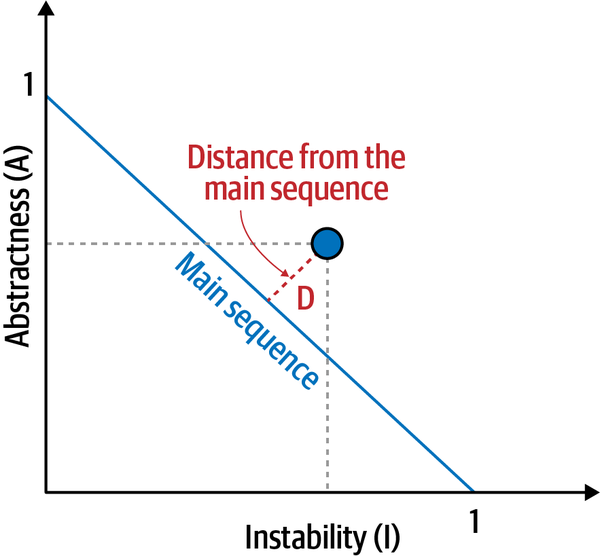

# Chapter 4 - Architectural Decomposition

Whereas architectural modularity describes the why for breaking apart a monolithic application, architectural decomposition describes the how.

Component-based decomposition is an extraction approach that applies various refactoring patterns for refining and extracting components (the logical building blocks of an application) to form a distributed architecture in an incremental and controlled fashion.

The tactical forking approach involves making replicas of an application and chipping away at the unwanted parts to form services, similar to the way a sculptor creates a beautiful work of art from a block of granite or marble.

## Is the Codebase Decomposable?
Big ball of mud - This indicates a software system that lacks a perceivable architecture. Although undesirable from a software engineering point of view, such systems are common in practice due to business pressures, developer turnover and code entropy.

Without careful governance, many software systems degrade into big balls of mud.

The key question the architect must answer becomes is this codebase salvageable? In other words, is it a candidate for decomposition patterns, or is another approach more appropriate?

### Afferent and Efferent Coupling

Afferent coupling measures the number of incoming connections to a code artifact (component, class, function, and so on). Efferent coupling measures the outgoing connections to other code artifacts.

### Abstractness and Instability

These metrics—abstractness and instability—measure the balance of the internal characteristics of a codebase.

Abstractness is the ratio of abstract artifacts (abstract classes, interfaces, and so on) to concrete artifacts (implementation classes).

In the equation, mᵃ represents abstract elements (interfaces or abstract classes) within the codebase, and mᶜ represents concrete elements.

Instability, is the ratio of efferent coupling to the sum of both efferent and afferent coupling

In the equation, Cᵉ represents efferent (or outgoing) coupling, and Cᵃ represents afferent (or incoming) coupling.

A component with an instability value near one is highly unstable, a value close to zero may be either stable or rigid: it is stable if the module or component contains mostly abstract elements, and rigid if it comprises mostly concrete elements. 

However, the trade-off for high stability is lack of reuse—if every component is self contained, duplication is likely.

### Distance from the Main Sequence

In the equation, A = abstractness and I = instability.
The distance-from-the-main-sequence metric imagines an ideal relationship between abstractness and instability

The closer to the line, the better balanced the component. Components that fall too far into the upper-right corner enter into what architects call the zone of uselessness: code that is too abstract becomes difficult to use. Conversely, code that falls into the lower-left corner enter the zone of pain: code with too much implementation and not enough abstraction becomes brittle and hard to maintain

## Component-Based Decomposition

Components in most applications are manifested through namespaces or directory structures and are implemented through component files (or source files).

## Tactical Forking

The tactical forking pattern was named by Fausto De La Torre as a pragmatic approach to restructuring architectures that are basically big balls of mud.

Generally, when architects think about restructuring a codebase, they think of extracting pieces

However, another way to think of isolating one part of a system involves deleting the parts no longer needed

The difference between extraction and deletion inspires the tactical forking pattern

The first step in tactical forking involves cloning the entire monolith, and giving each team a copy of the entire codebase

Then each team continues the gradual elimination of unwanted code.

At the completion of the tactical forking pattern, teams have split the original monolithic application into two parts, preserving the coarse-grained structure of the behavior in each part

### Trade-Offs

Tactical forking is a viable alternative to a more formal decomposition approach, most suited to codebases that have little or no internal structure. 

#### Benefits
- Teams can start working right away with virtually no up-front analysis.

- Developers find it easier to delete code rather than extract it. Extracting code from a chaotic codebase presents difficulties because of high coupling, whereas code not needed can be verified by compilation or simple testing.

#### Shortcomings
- The resulting services will likely still contain a large amount of mostly latent code left over from the monolith.

- Unless developers undertake additional efforts, the code inside the newly derived services won’t be better than the chaotic code from the monolith—there’s just less of it.

- Inconsistencies may occur between the naming of shared code and shared component files, resulting in difficultly identifying common code and keeping it consistent.

