# Chapter 5 - Component-Based Decomposition Patterns

### Introduction:
Component-based decomposition is a potent strategy for transitioning from a monolithic application to a distributed architecture. This chapter introduces a series of patterns aimed at breaking down monolithic codebases into well-defined components that can eventually evolve into services. These patterns streamline the process of migrating from a monolithic to a distributed architecture.

The patterns are:

- Identify and Size Components Pattern
- Gather Common Domain Components Pattern
- Flatten Components Pattern
- Determine Component Dependencies Pattern
- Create Component Domains Pattern
- Create Domain Services Pattern

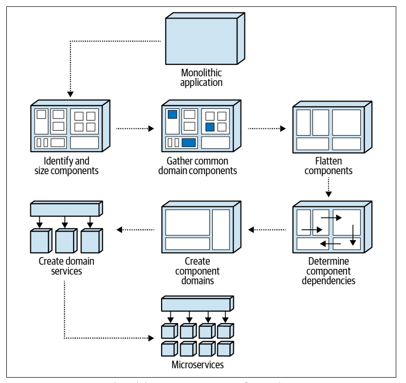

### Architecture Stories:
An architecture story is a method for documenting and explaining code refactoring that influences the structural aspects of the application within the Sysops Squad sagas. Unlike user stories, which focus on implementing or changing features, architecture stories describe specific code refactoring that impacts the overall architecture of the application and addresses various business drivers, such as scalability or time-to-market improvements.

For example:
> "As an architect, I need to decouple the payment service to support better extensibility and agility when integrating additional payment types."

It's essential to distinguish architecture stories from technical debt stories. While technical debt stories typically address code cleanup tasks for developers in later iterations, architecture stories focus on promptly addressing changes to support specific architectural characteristics or business requirements.

### 1. Identify and Size Components Pattern

#### Description:
The success of building services depends not only on identifying but also correctly sizing the components of the application. The main objective of this pattern is to identify components that are either too large (doing too much) or too small (doing too little), as vastly different sizes can lead to excessive coupling or difficulties in breaking into separate services. It is essential to note the challenge in determining the size of a component. Traditional metrics like the number of files and lines of code often lack precision. A useful metric is the total number of statements in a component as it indicates the complexity and activity of that component. Architects should aim for relatively consistent component sizes, typically falling within one to two standard deviations from the mean.

Important data for analysis:

- **Component Name:** 
A descriptive identifier for the component to facilitate understanding in diagrams and documentation. It's recommended that the name be self-explanatory.

- **Component Namespace:** A physical or logical identification of the component, describing where the files are stored. Consistency in the type of identifier used is crucial.

- **Percent:** The size of the component relative to the total application source code, indicating whether it's too large or too small.

- **Statements:** The sum of all declarations in the component's code files, reflecting its complexity and activity.

- **Files:** The total number of code files belonging to the component, including classes, interfaces, etc.

#### Fitness Functions for Governance:
It's important to apply automated governance post-decomposition of components to ensure that any alterations or analyses remain as intended by the pattern.

**1. Fitness Function: Maintain Component Inventory:**

Identifies additions or removals of components, crucial for maintaining architectural consistency.

**2. Fitness Function: No Component Shall Exceed <Some Percent> of the Overall Codebase:** 

Identifies components exceeding a predefined percentage of the overall codebase.

**3. Fitness Function: No Component Shall Exceed <Some Number of Standard Deviations> from the Mean Component Size:**

Utilizes standard deviations based on the total number of code declarations in components to identify those exceeding a specified number of deviations from the average size.

#### In Practice with Sysops Squad:

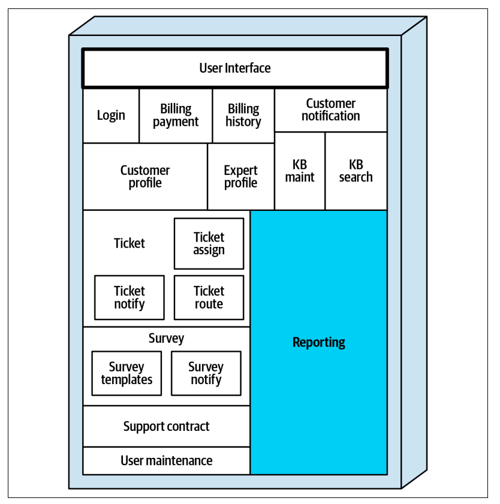

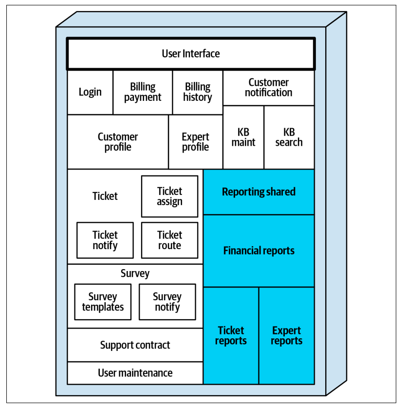

### 2. Gather Common Domain Components Pattern

#### Description:
The goal of this pattern is to identify and merge common domain functionalities into a single component to eliminate duplicated services in the process of breaking down a monolith.
The distinction between shared domain functionality and shared infrastructure functionality: shared domain functionality is part of the business processing logic of an application (such as notifications), while shared infrastructure functionality is already an operational matter common to all processes, such as metrics collection and security.

This process of identifying common functionality is often done manually, but it is possible to use automation for it. A basic way to identify common domain functionality is by the name of the component or corresponding namespace.

#### Fitness Functions:
The difficulty of automating these functions is highlighted by the identification of functionality and the subjective nature of differentiating between domain and infrastructure functionality.

**1. Fitness Function: Find common names in leaf nodes of component namespace:**

Searches for common names in the namespaces of components to identify shared functionalities.

**2. Fitness Function: Find common code across components:**

Identifies common classes used among namespaces and alerts the architect about possible functionality duplication.

#### In Practice with the Sysops Squad:

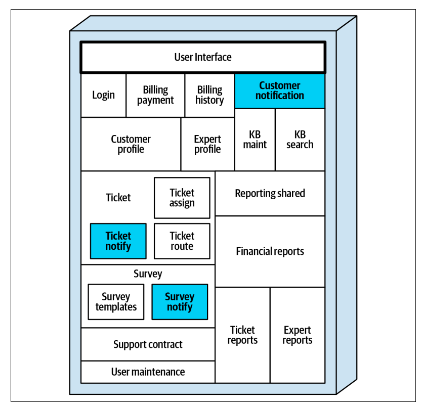

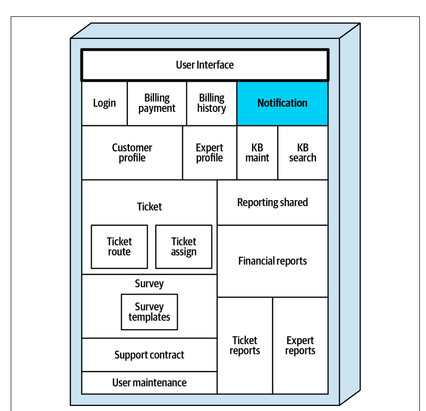

### 3. Flatten Components Pattern

#### Description:
The Flatten Components Pattern is applied to ensure that components are not built on top of each other. The idea is to construct them as *leaf nodes*, following a namespace structure. When a namespace representing a specific component is extended, meaning another node is added to the structure of that namespace, it no longer represents a component; it represents a subdomain. To address this issue, the flatten pattern defines a component as the last node of the namespace or directory. 

For example: `ss.survey.templates` is a component, while `ss.survey` is considered a subdomain. Additionally, namespaces like `ss.survey` are defined as root namespaces because they are extended with other nodes.

Important terms for this Pattern:

- **Components:**

A collection of classes grouped within the same namespace because they perform some common functionality in the application.

- **Root Namespace:**

A node of the namespace extended by another node of that namespace. A root namespace can also be called a subdomain.

- **Orphaned Classes:**

Classes contained within the root namespace, meaning they are not associated with a defined component.

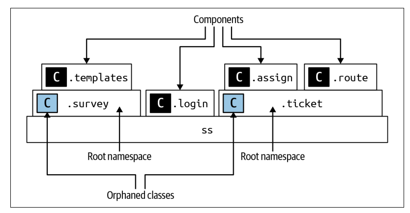

In this pattern, the process of reorganizing components is referred to  **flattening**, involving the breakdown or construction of namespaces within an application to remove orphaned classes. One way to apply flattening is by moving source code from an extended namespace to the "parent" namespace, thus creating a single component. As in the image below:

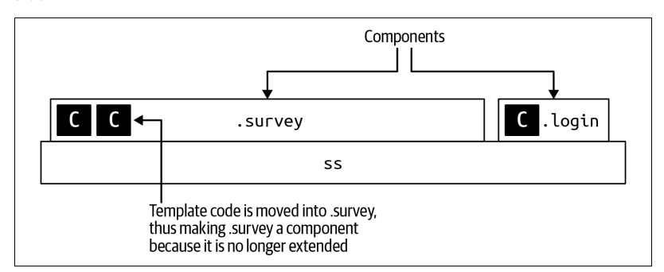

Another method is to identify functional areas that can be separated within the subdomain and then form components based on these divisions. As in the image below:

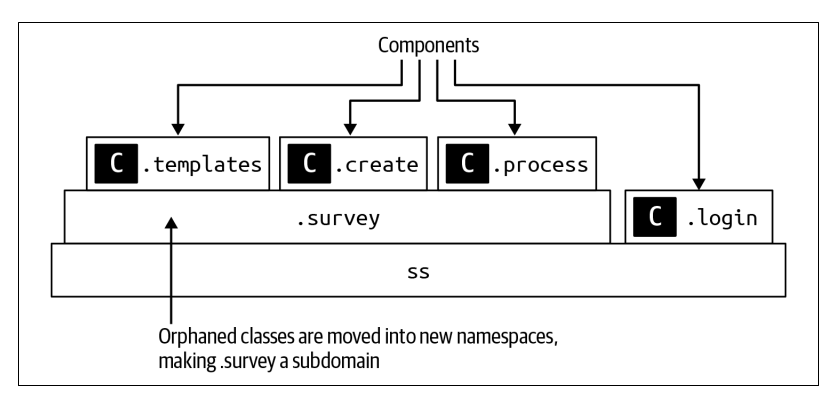

Where there is code shared by other components within the same namespace, these shared classes at the root are considered orphaned classes, even if they are shared code. As shown in the figure below:

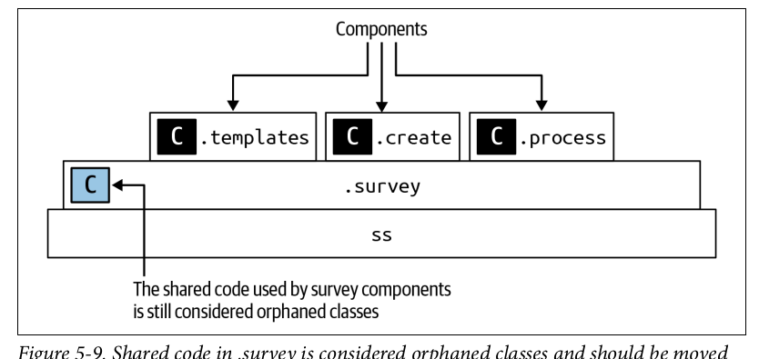

The flatten pattern is applied, and the orphaned code is moved to a new component:

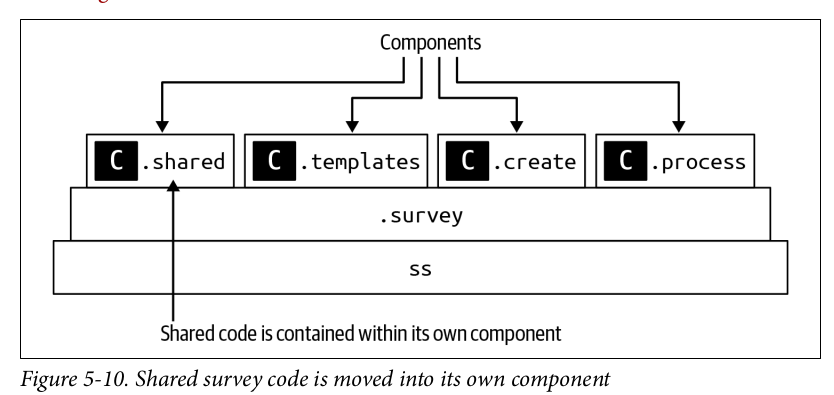

#### Fitness Functions for Governance:
A fitness function is presented to aid in automating governance to maintain flat components, i.e., having only leaf nodes, as shown in the images above.

**1. Fitness Function: No source code should reside in a root namespace:**

This function serves to locate orphaned classes. The author emphasizes that this function assists both during migration and in maintaining the monolith while migration is underway.

#### In Practice with the Sysops Squad:

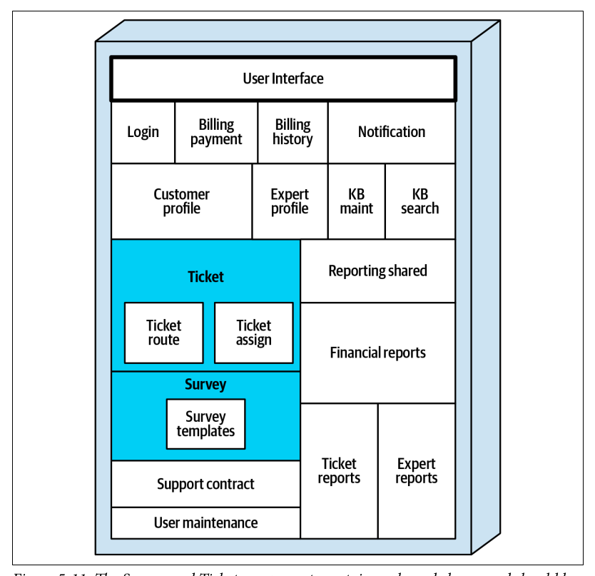

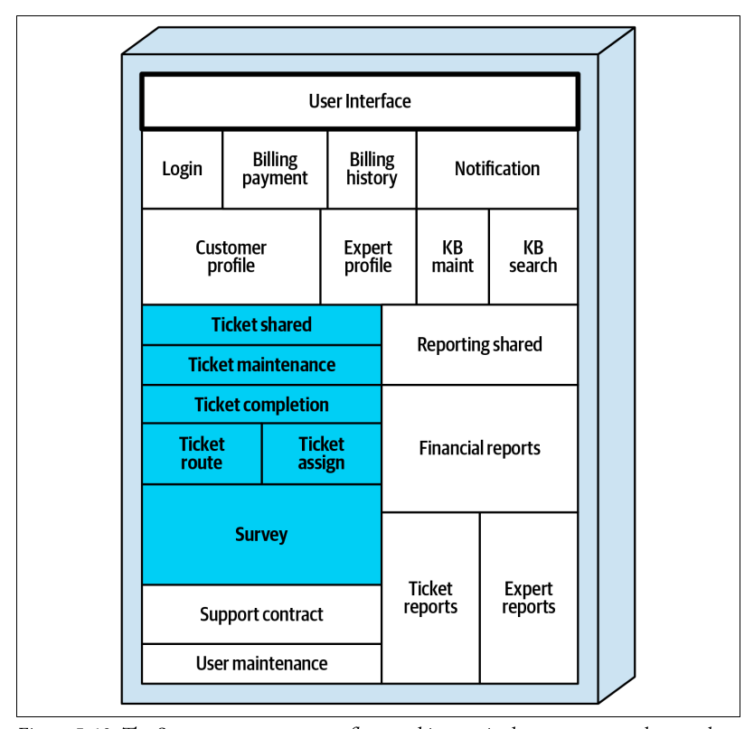

### 4. Determine Component Dependencies Pattern

#### Description:

This pattern aids in evaluating the size and effort applied to migration. It provides a clear analysis of dependencies between components, helping to understand the complexity and scope of the migration being undertaken. It is an approach to analyze interactions between monolithic components and understand how they are coupled, facilitating the process of breaking them down into smaller services. 

It focuses on component dependencies rather than individual classes. The author defines a component dependency as formed when a class from one component interacts with another class from another component. 

Some IDEs are helpful in applying this pattern as they allow visualization of dependencies between components.

A dependency diagram of the components is displayed, where each box represents a component, and the lines represent the couplings between them.

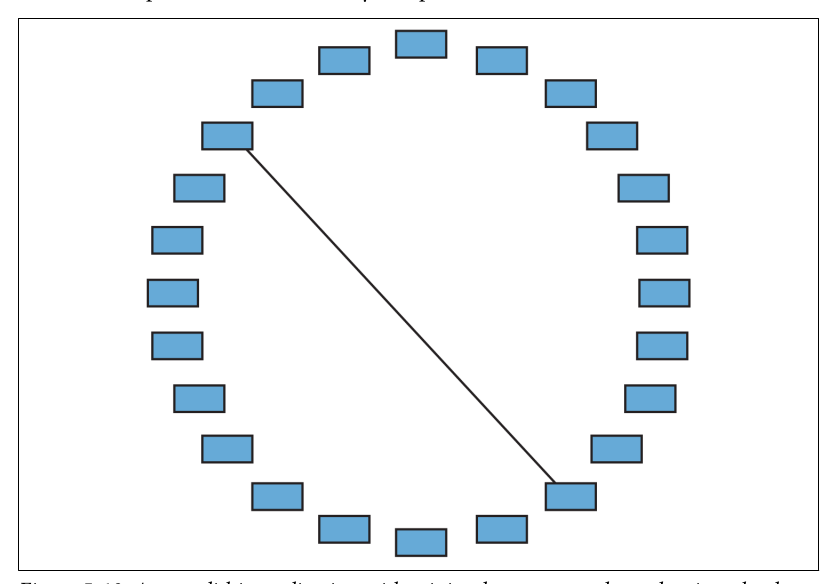

Diagram of an application with a high level of dependencies between components

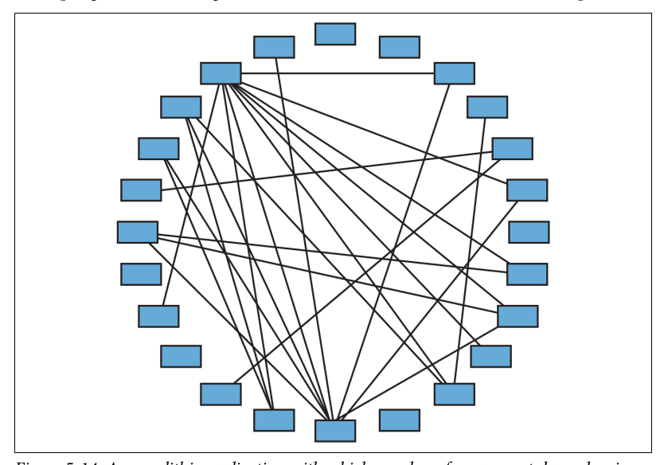

Diagram of an application with an even higher level of dependencies between components

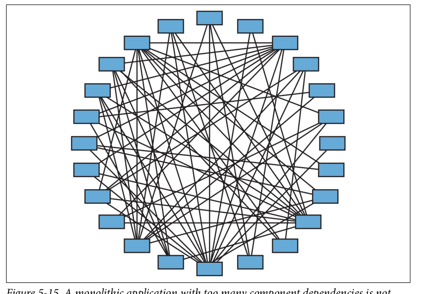

#### Fitness Functions:

**1. Fitness Function: No component shallhave more than <some number> of total dependencies:**

The architect sets a maximum limit based on the overall coupling level of the application and the number of components. The function alerts if the total dependencies of a component exceed this defined limit.

**2. Fitness Function: <some component> should not have dependency on <another component>:**

This function restricts certain components from having dependencies on specific other components.

#### In Practice with the Sysops Squad:

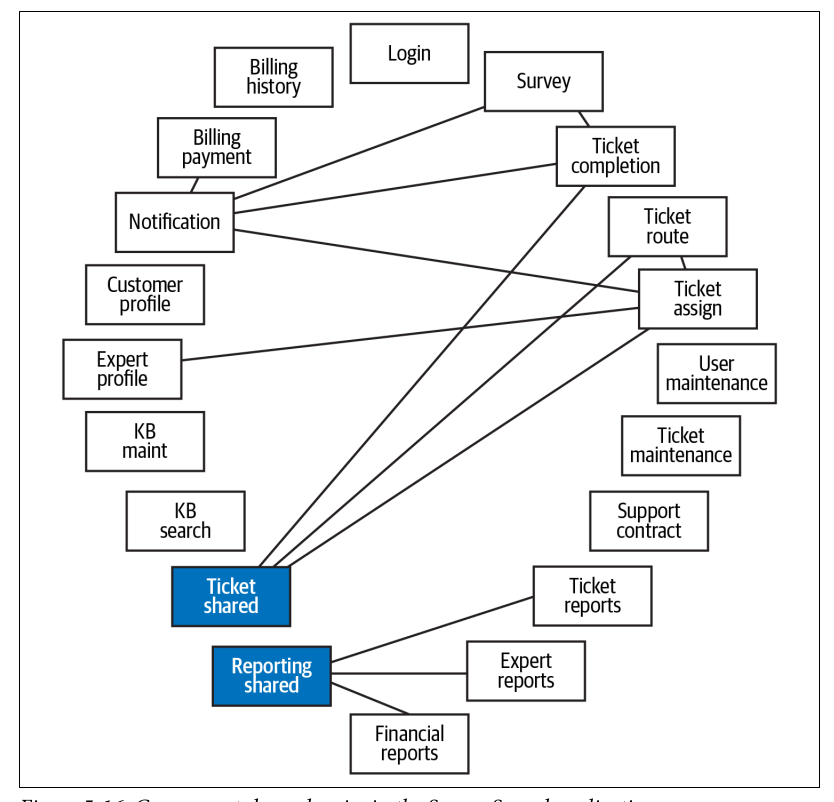

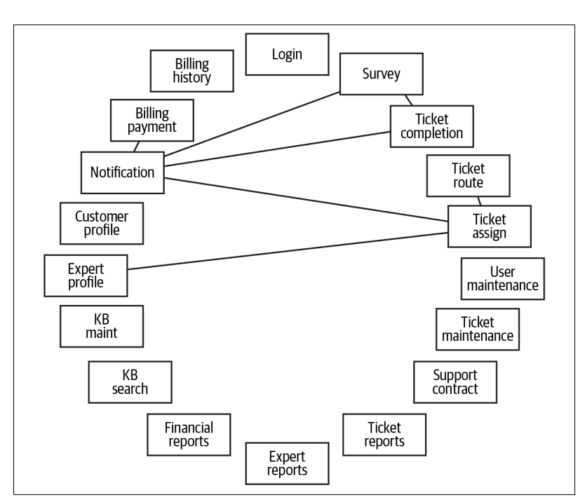

### 5. Create Component Domains Pattern

#### Description:
The idea behind this pattern is to group monolithic components according to their logic, aiming to facilitate the creation of more granular services during the decomposition process. 

The author emphasizes that although each monolithic component could potentially be considered a candidate to become a separate service, the relationship between a service and components is one-to-many, meaning a single service can have one or more components. 

Therefore, the pattern aims to organize related components into more cohesive domains, with the intention of transforming them into more granular services.

To implement this pattern, the author discusses the need to identify component domains, which are groups of components that have related functionalities.

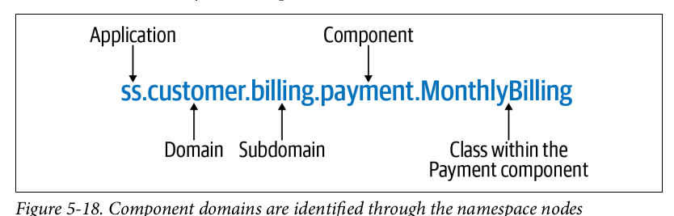

#### Fitness Function:

**1. Fitness Function: All namespaces under <root namespace> should be restricted to <list of domains>:** 

This function helps prevent the creation, without notice, of new domains by a team member. The idea is to alert the architect if new namespaces are created outside of a predefined list of domains.

#### In Practice with the Sysops Squad:

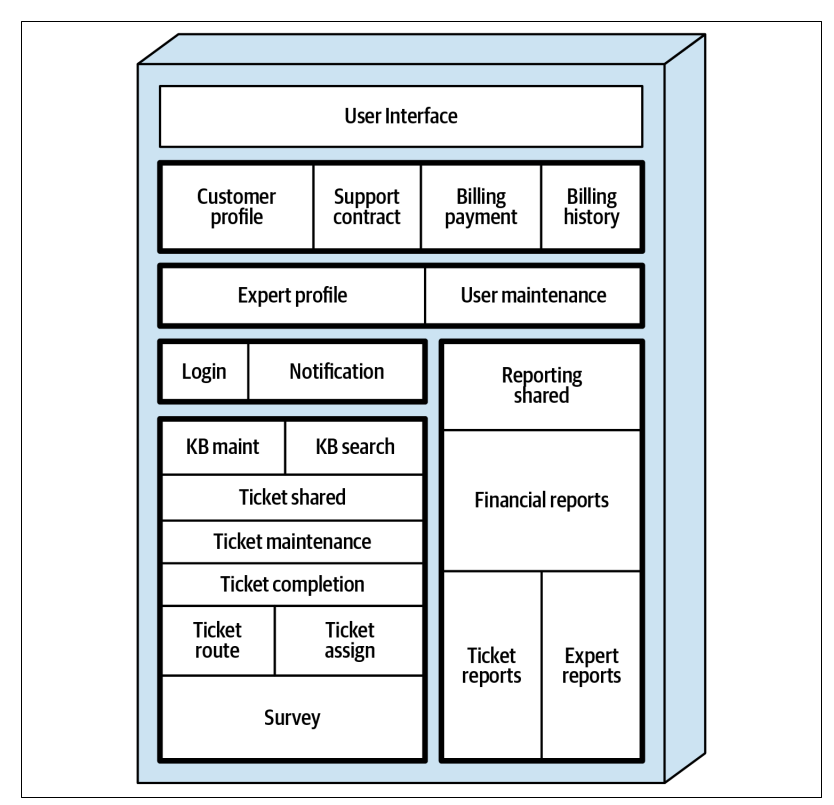

### 6. Create Domain Services Pattern

#### Description:
With the components identified, sized, leveled, and grouped into domains, they can now be moved to separately deployed domain services, creating what is known as a service-based architecture. 

In this pattern, the architect extracts the groups of components that have already been defined in domains and transforms each of them into independent services, transitioning from a monolith to a service-based architecture.

Image of a service-based architecture:

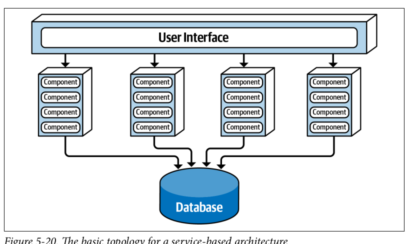

It is important to note that migrating first to a service-based architecture allows both the architect and developers to learn more about each of the services to determine whether they should be further divided into smaller services within a microservices architecture or kept as larger domain services.

Figure 5-21
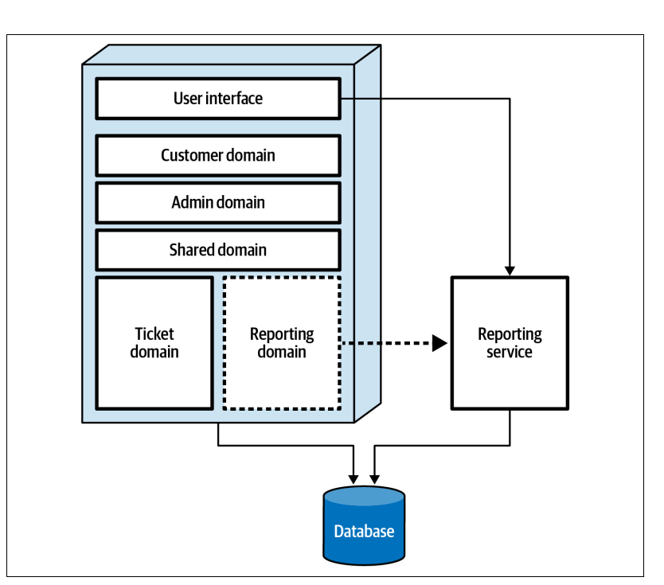

**Author's Advice:** Do not apply this pattern until identification and refactoring of all component domains have been completed, as this helps minimize the need for changes to each domain service when moving the related components.

#### Fitness Function:

**1. Fitness Function: All components in <some domain service> should start with the same namespace:** 

The aim is to ensure that namespaces and, consequently, components remain consistent within a domain service.

#### In Practice with the Sysops Squad:
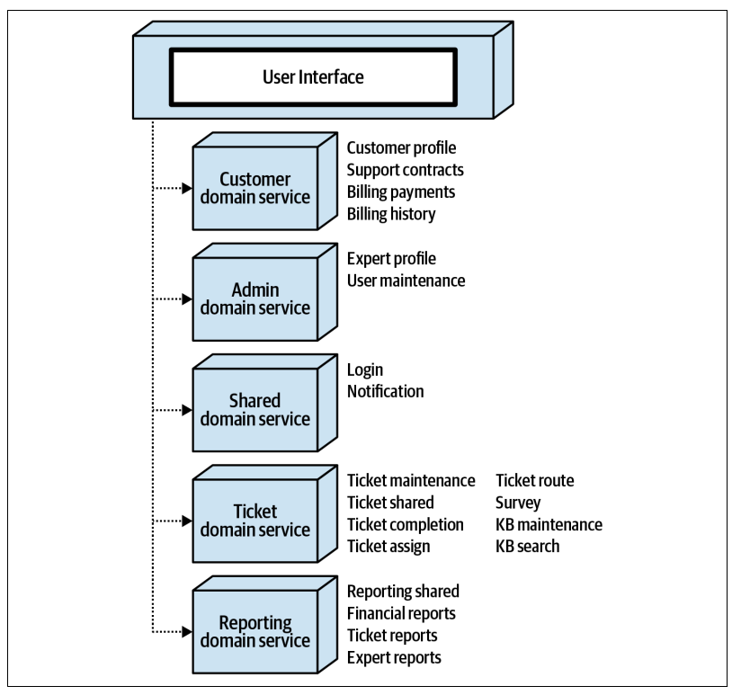
