# Service Granularity

## Modularity
- Constructed with standardized units or dimensions for flexibility and variety in
use.

## Granularity
- Consisting of or appearing to consist of one of numerous particles forming a
larger unit.

Regarding book usage terms, *modularity* concerns breaking up systems into separate parts, whereas
*granularity* deals with the size of those separate parts.

## Measuring Granularity

One such metric used to objectively measure the size of a service is to calculate the number of statements in a
service. Every developer has a different coding style and technique, which is why the
number of classes and number of lines of code are poor metrics to use to measure
granularity. An important point is that a statement is a single complete action performed in the source code,
usually terminated by a special character.

Another metric to determine service granularity is to measure and track the number
of public interfaces or operations exposed by a service.

## Granularity Disintegrators

Granularity disintegrators provide guidance and justification for when to break a service into smaller pieces.

### Service Scope and Function

The author confirms that are two dimensions to consider when analyzing the service scope and function. 

The first dimension is *cohesion*: the degree and manner to which the operations of a particular
service interrelate. 

The second dimension is the overall size of a component, measured usually in terms of the total number of statements summed from the classes that make up that service, the number of public entrypoints into the service, or both.

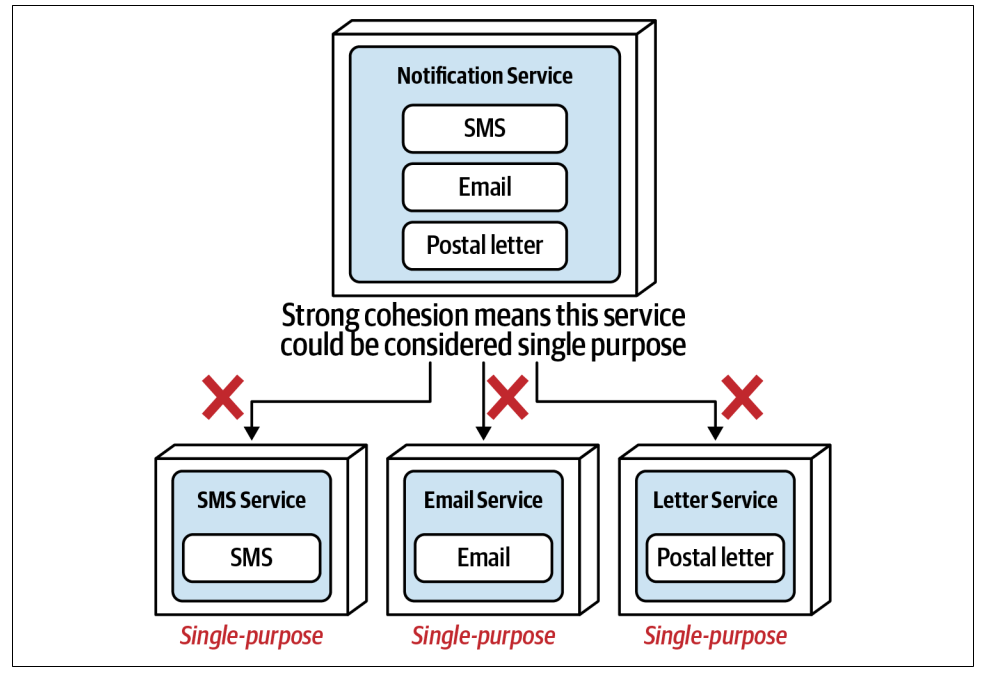

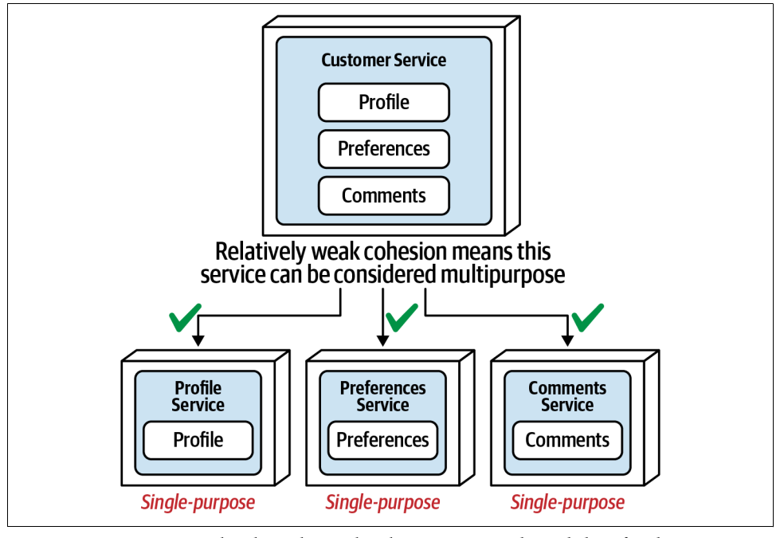

### Code Volatility

Volatility measure the rate at which source code changes. Objectively measuring the frequency of code changes in a service (easily done through standard facilities in any source code version-control system) can sometimes lead to a good justification for breaking apart a service 

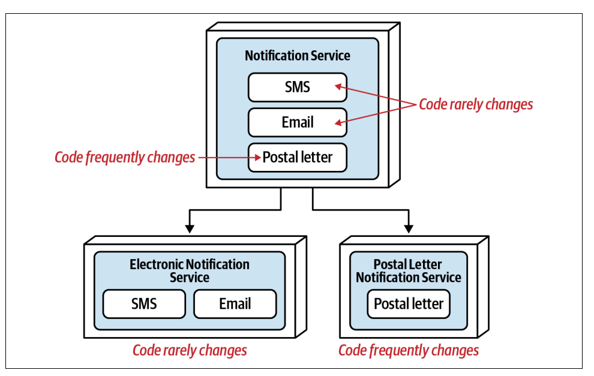

### Scalability and Throughput

Although scalability and thoughput concepts can be self-explained due to our daily-basis context, the author brings an interesting image to illustrate how we can break services up regarding these metrics as shown below.

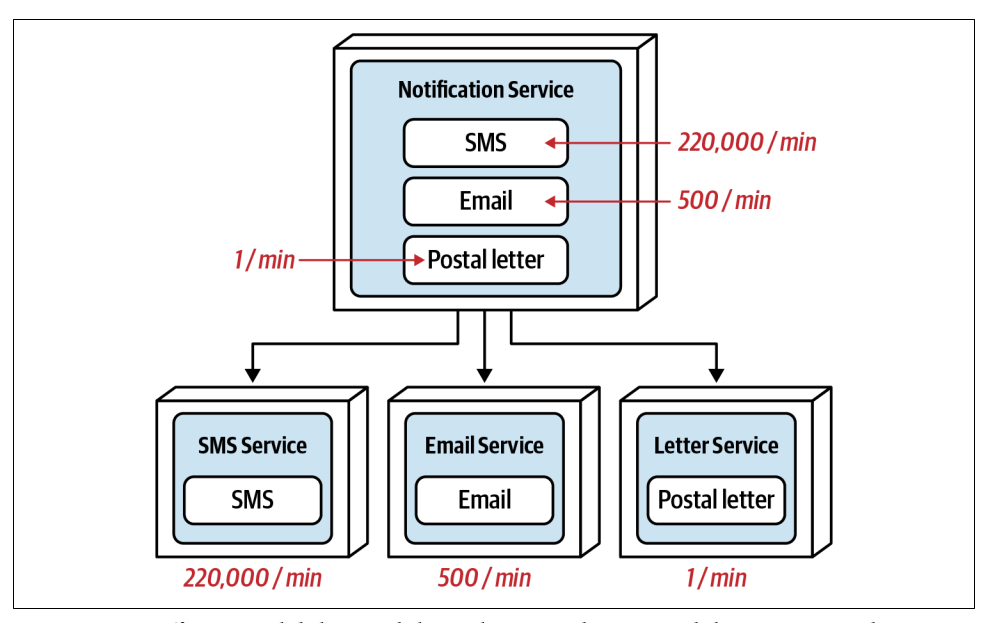

### Fault Tolerance

Fault tolerance describes the ability of an application or functionality within a particular domain to continue to operate, even though a fatal crash occurs (such as an out-of-memory condition). Fault Tolerance is another good driver for granularity disintegration.

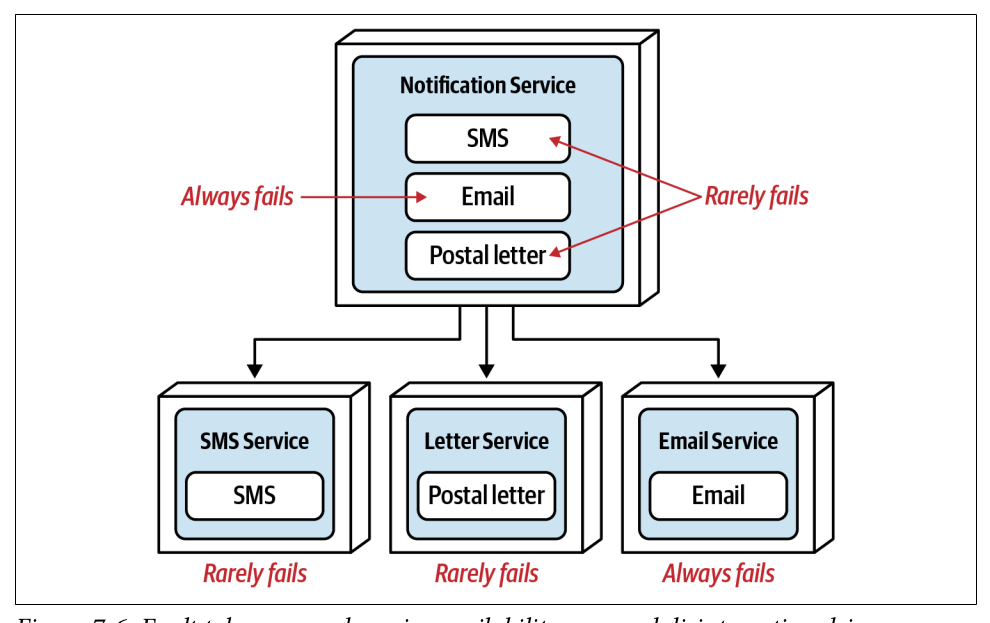

### Security

A common pitfall when securing sensitive data is to think only in terms of the storage
of that data. For example, securing PCI (Payment Card Industry) data from non-PCI
data might be addressed through separate schemas or databases residing in different
secure regions. What is sometimes missing from this practice, however, is also securing how that data is accessed. The example below shows a good example of service division in order to mitigate security issues.

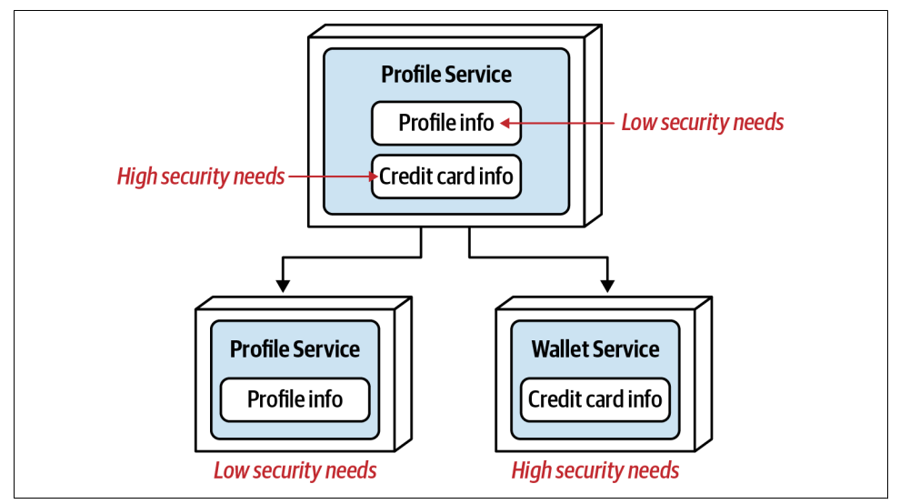

### Extensibility

Another primary driver for granularity disintegration is *extensibility*, which means the ability
to add additional functionality as the service context grows. For example, imagine a payment method service, how easy is it to extend the payment service to add these additional payment methods?  

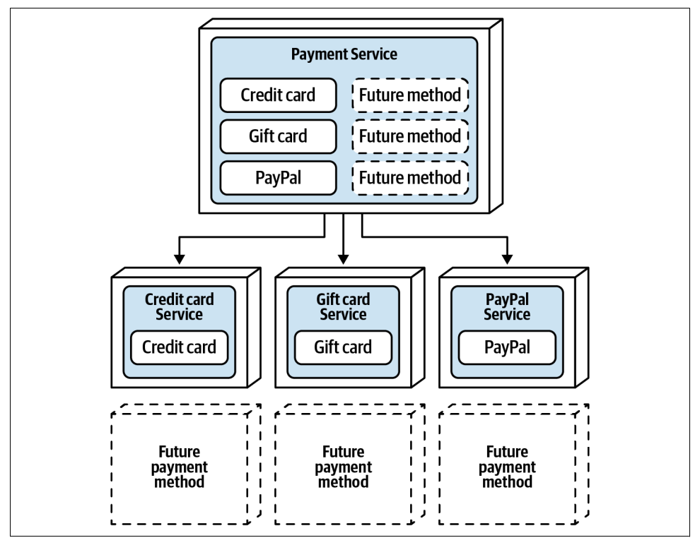

## Granularity Integrators

Granularity integrators work in the opposite way in terms of Granularity Disintegrators. They provide guidance and justification for putting services back together (or not breaking apart a service in the first place).

### Database Transactions

Most monolithic systems and course-grained domain services using relational databases rely on single-unit-of-work database transactions to maintain data integrity and consistency. To understand how database transactions impact service granularity, consider the situation below:

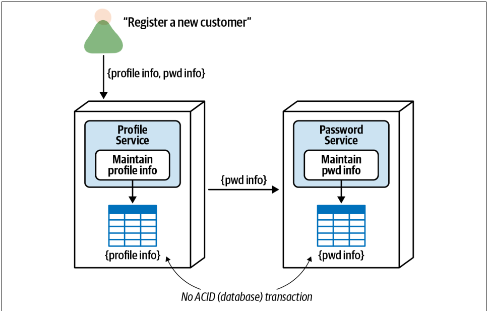

If the password service fails during either of these operations, data is left in an inconsistent state, resulting in complex error handling (which is also error prone) to reverse the original profile insert or take other corrective action. Thus, if having a single-unit-of-work ACID transaction is required from a business perspective, these services should be consolidated into a single service.

### Workflow and Choreography

Another common granularity integrator is workflow and choreography--services talking to one another (also sometimes referred to as interservice communication or east-west communications). When breaking apart services, always check to see if the functionalities are tightly coupled and dependent on one another. If it is, then overall fault tolerance from a business request standpoint won’t
be achieved, and it might be best to consider keeping the services together.

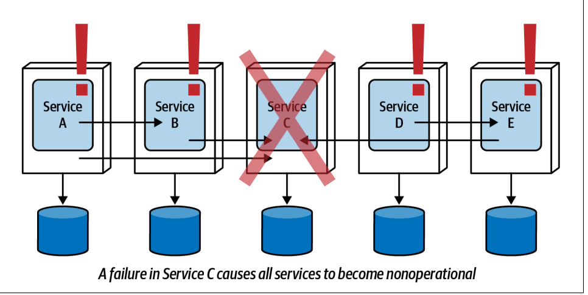

A large customer service is split into five separate services (services A through E). While each of these services has its own collection of cohesive atomic requests, retrieving all of the customer information collectively from a single API request into a single user interface screen involves five separate hops when using choreography and it can take up so much time - this assumes, of course, that overall performance matters.

#### Shared Code

Shared source code is a common (and necessary) practice in software development.

Consider the set of five services shown in the last section. While there may have been a good disintegrator driver for breaking apart these services, they all share a common codebase of domain functionality (as opposed to common utilities or infrastructure functionality). If a change occurs in the shared library, this would eventually necessitate a change in the corresponding services using that shared library - eventually because versioning can sometimes be used to provide backward compatibility and agility.

Some of the guidelines for considering shared code as a granularity integrator are:
- Specific shared domain functionality
- Frequent shared code changes
- Defects that cannot be versioned

### Data Relationships

Another trade-off in the balance between granularity disintegrators and integrators is the relationship between the data that a single consolidated service uses as opposed to the data that separate services would use. Considering the image below, the solid lines pointing to the tables represent writes to the tables (hence data ownership), and the dotted lines pointing away from the tables represent read-only access to the table.

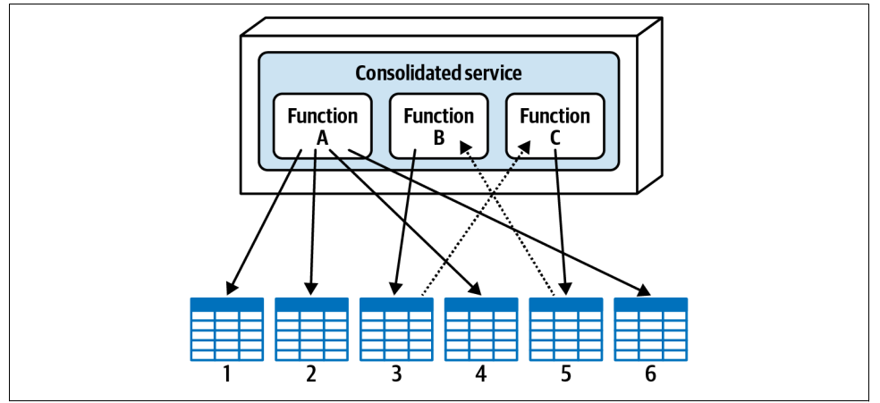

Assume that based on some of the disintegration drivers outlined, this service was broken into three separate services as shown below:

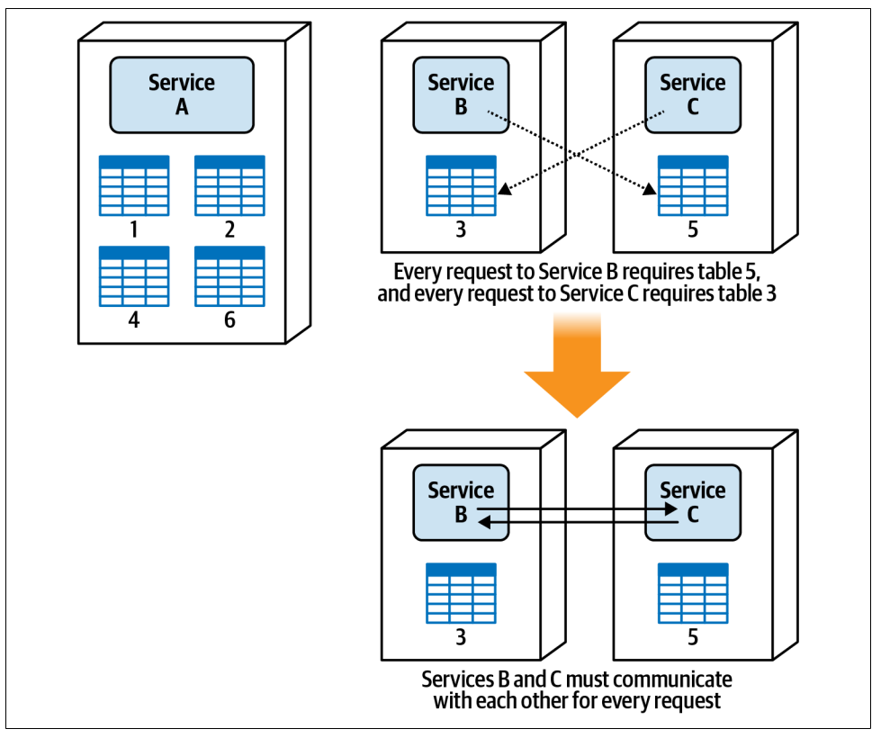

Based on the dependency of the data between services B and C, it would be wise to consolidate those services into a single service to avoid the latency, fault tolerance, and scalability issues associated with the interservice communication between these services, demonstrating that relationships between tables can influence service granularity.

## Conclusion

As a resume, we can separated granularity integrators and disintegrators in two tables:

### Disintegrator Drivers

| Disintegrator Driver | Reason for applying driver                          |
|----------------------|-----------------------------------------------------|
| Service scope        | Single-puropose services with tight cohesion        |
| Code Volatility      | Agility (reduces testing scope and deployment risk) |
| Scalability          | Lower costs and faster responsiveness               |
| Fault Tolerance      | Better overall uptime                               |
| Security Access      | Better security access control to certain functions |
| Extensibility        | Agility (ease of adding new functionality)          |

### Integrator Drivers

| Integrator Driver     | Reason for applying driver                  |
|-----------------------|---------------------------------------------|
| Database transactions | Data integrity and consistency              |
| Workflow              | Fault Tolerance, performance and reliabilty |
| Shared Code           | Maintainability                             |
| Data relationships    | Data integrity and correctness              |