# Reuse Patterns

Code reuse is a normal part of software development. Common business domain functionality, such as formatters, calculators, validators, and auditing, are typically shared across multiple components, as is common infrastructure functionality, such as security, logging, and metrics gathering.

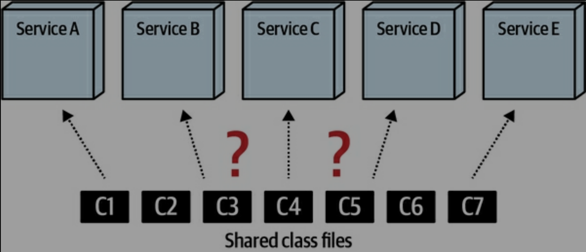

Frequently within highly distributed architectures like microservices and serverless environments, phrases like “reuse is abuse!” and “share nothing!” are touted by architects in an attempt to reduce the amount of shared code within these types of architectures. Architects in these environments have even been found to offer countering advice to the famous DRY principle (Don’t repeat yourself) by using an opposing acronym called WET (Write every time or Write everything twice).

In this chapter, we introduce several techniques for managing code reuse within a distributed architecture, including replicating code, shared libraries, shared services, and sidecars within a service mesh. For each of these options, we also discuss the pros, cons, and trade-offs of each approach.

## Code Replication

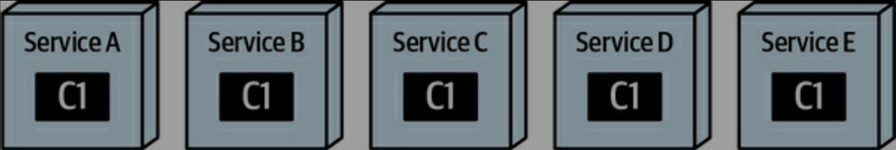

While code replication isn’t used much today, it nevertheless is still a valid technique for addressing code reuse across multiple distributed services. This technique should be approached with extreme caution for the obvious reason that if a bug is found in the code or an important change to the code is needed, it would be very difficult and time-consuming to update all services containing the replicated code.

At times, however, this technique can prove useful, particularly for highly static one-off code that most (or all) services need.

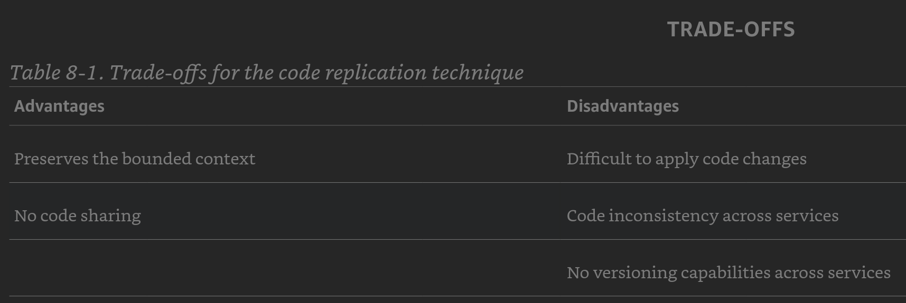

### When to Use

The replication technique is a good approach when developers have simple static code (like annotations, attributes, simple common utilities, and so on) that is either a one-off class or code that is unlikely to ever change because of defects or functional changes.

## Shared Library

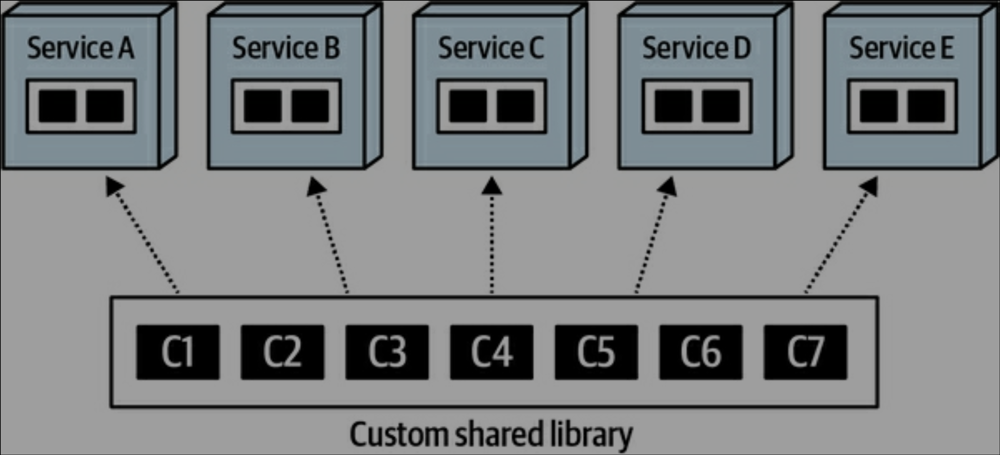

One of the most common techniques for sharing code is to use a shared library. A shared library is an external artifact (such as a JAR file, DLL, and so on) containing source code that is used by multiple services which is typically bound to the service at compile time (see Figure 8-3). Although the shared library technique seems simple and straightforward, it has its share of complexities and trade-offs, not the least of which is shared library granularity and versioning.

### Dependency Management and Change Control

Note that while the dependency management is relatively straightforward (each service uses the single shared library), change control is not. If a change occurs to any of the class files in the coarse-grained shared library, every service, whether it cares about the change or not, must eventually adopt the change because of a version deprecation of the shared library. This forces unnecessary retesting and redeployment of all the services using that library, therefore significantly increasing the overall testing scope of a shared library change.

Breaking shared code into smaller functionality-based shared libraries (such as security, formatters, annotations, calculators, and so on) is better for change control and overall maintainability, but unfortunately creates a mess in terms of dependency management. As shown in Figure 8-5, a change in shared class C7 impacts only Service D and Service E, but managing the dependency matrix between shared libraries and services quickly starts looking like a big ball of distributed mud (or what some people refer to as a distributed monolith).

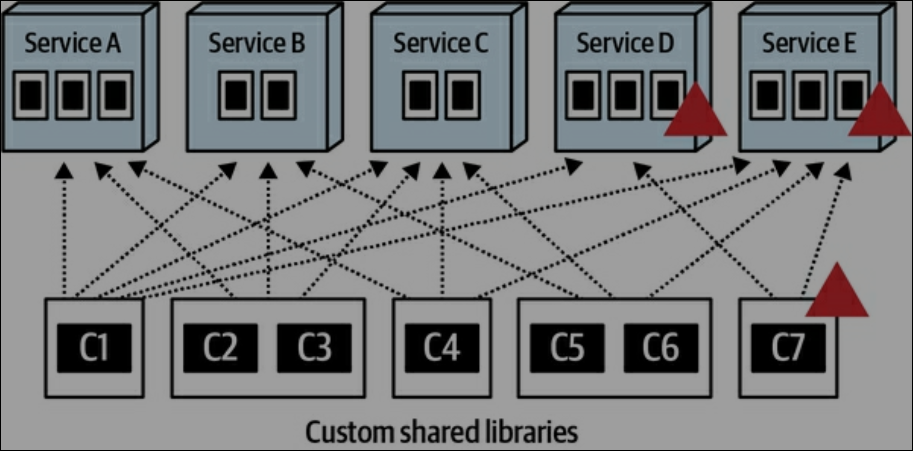

Given these trade-offs of change control and dependency management, our advice is to generally avoid large, coarse-grained shared libraries and strive for smaller, functionally partitioned libraries whenever possible, thus favoring change control over dependency management. For example, carving off relatively static functionality such as formatters and security (authentication and authorization) into their own shared libraries isolates this static code, therefore reducing the testing scope and unnecessary version deprecation deployments for other shared functionality.

### Versioning Strategies

Our general advice about shared library versioning is to always use versioning! Versioning your shared libraries provides not only backward compatibility, but also a high level of agility—the ability to respond quickly to change.

While the preceding advice may seem obvious, there are trade-offs and hidden complexity in versioning. As a matter of fact, versioning can be so complex that your authors often think of versioning as the ninth fallacy of distributed computing: “versioning is simple”

One of the first complexities of shared library versioning is communicating a version change. In a highly distributed architecture with multiple teams, it is often difficult to communicate a version change to a shared library. How do other teams know that Validation.jar just increased to version 1.5? What were the changes? What services are impacted? What teams are impacted? Even with the plethora of tools that manage shared libraries, versions, and change documentation (such as JFrog Artifactory), version changes must nevertheless be coordinated and communicated to the right people at the right time.

Another complexity is the deprecation of older versions of a shared library—removing those versions no longer supported after a certain date. Deprecation strategies range from custom (for individual shared libraries) all the way to global (for all shared libraries). And, not surprisingly, trade-offs are involved with both approaches.

Assigning a custom deprecation strategy to each shared library is usually the desired approach because libraries change at different rates.

While the shared library technique allows changes to be versioned (therefore providing a good level of agility for shared code changes), dependency management can be difficult and messy. Table 8-2 lists various trade-offs associated with this technique.

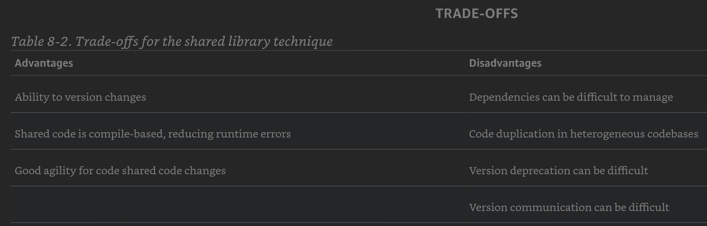

### When to Use

The shared library technique is a good approach for homogeneous environments where shared code change is low to moderate. The ability to version (although sometimes complex) allows for good levels of agility when making shared code changes. Because shared libraries are usually bound to the service at compile time, operational characteristics such as performance, scalability, and fault tolerance are not impacted, and the risk of breaking other services with a change to common code is low because of versioning.

## Shared Service

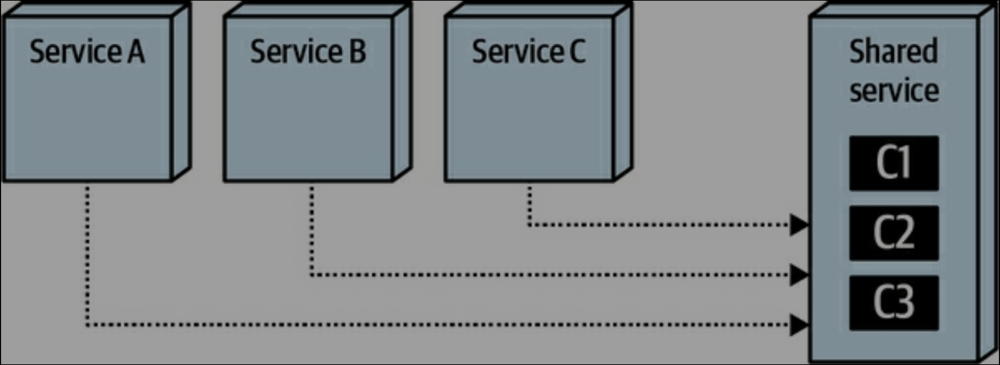

The primary alternative to using a shared library for common functionality is to use a shared service instead. The shared service technique, illustrated in Figure 8-6, avoids reuse by placing shared functionality in a separately deployed service.

One distinguishing factor about the shared service technique is that the shared code must be in the form of composition, not inheritance.

Back in the day, shared services were a common approach to address shared functionality within a distributed architecture. Changes to shared functionality no longer require redeployment of services; rather, since changes are isolated to a separate service, they can be deployed without redeploying other services needing the shared functionality. However, like everything in software architecture, many trade-offs are associated with using shared services, including change risk, performance, scalability, and fault tolerance.

### Change Risk

If only life were that simple! The problem, of course, is that a change to a shared service is a runtime change, as opposed to a compile-based change with the shared library technique. As a result, a “simple” change in a shared service can effectively bring down an entire system, as illustrated in Figure 8-8.

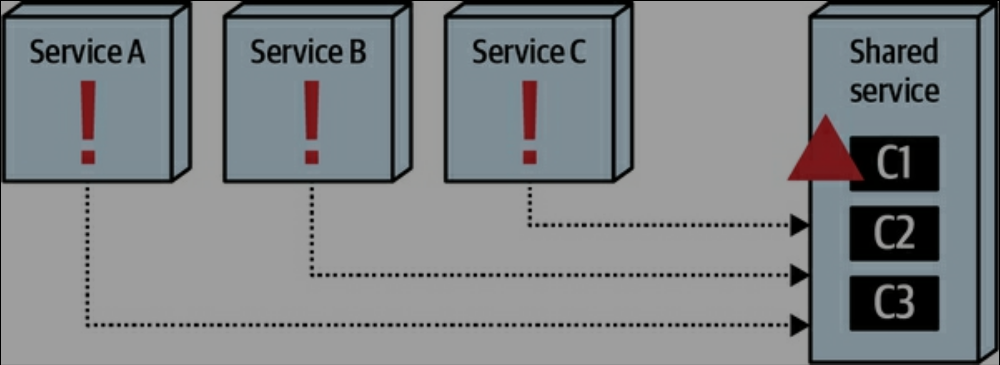

This necessarily brings to the forefront the topic of versioning. In the shared library technique, versioning is managed through compile-time bindings, significantly reducing risk associated with a change in a shared library. However, how does one version a simple shared service change?

The immediate response, of course, is to use API endpoint versioning—in other words, create a new endpoint containing each shared service change, as shown in Example 8-3.

Another problem with API endpoint versioning is that it assumes all access to the shared service is through a RESTful API call going through a gateway or via point-to-point communication. However, in some cases, access to a shared service through interservice communication is commonly done through other types of protocols such as messaging and gRPC (in addition to a RESTful API call). This further complicates the versioning strategy for a change, making it difficult to coordinate versions across multiple protocols.

### Performance

Because services requiring the shared functionality must make an interservice call to a shared service, performance is impacted because of network latency (and security latency, assuming the endpoints to the shared service are secure). This trade-off, shown in Figure 8-9, does not exist with the shared library technique when accessing shared code.

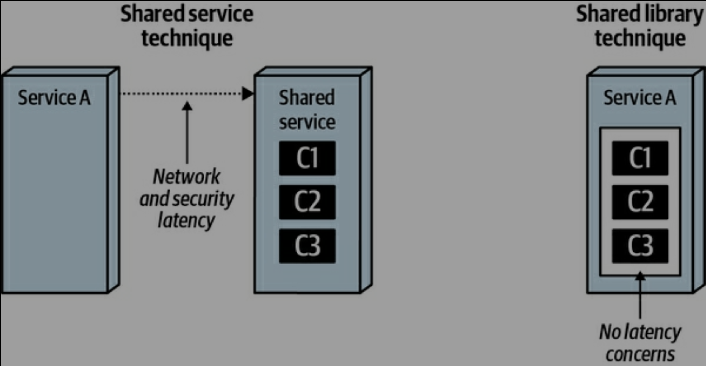

### Scalability

Another drawback of the shared service technique is that the shared service must scale as services using the shared service scale. This can sometimes be a mess to manage, particularly with multiple services concurrently accessing the same shared service. However, as illustrated in Figure 8-10, the shared library technique does not have this issue because the shared functionality is contained within the service at compile time.

### Fault Tolerance

While fault-tolerance issues can usually be mitigated through multiple instances of a service, nevertheless it is a trade-off to consider when using the shared service technique. As illustrated in Figure 8-11, if the shared service becomes unavailable, services requiring the shared functionality are rendered nonoperational until the shared service is available. The shared library technique does not have this issue since the shared functionality is contained in the service at compile time, and therefore accessed through standard method or function calls.

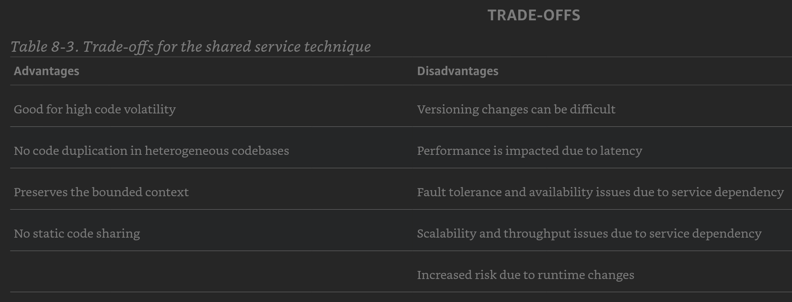

### When to Use

The shared service technique is good to use in highly polyglot environments (those with multiple heterogeneous languages and platforms), and also when shared functionality tends to change often. While changes in a shared service tend to be much more agile overall than with the shared library technique, be careful of runtime side-effects and risks to services needing the shared functionality.

## Sidecards and Service Mesh

One of the design goals of microservices architectures is a high degree of decoupling, often manifested in the advice “Duplication is preferable to coupling.”

Thus, in microservices architecture, the answer to the question of “should we duplicate or couple to some capability?” is likely duplicate, whereas in another architecture style such as a service-based architecture, the correct answer is likely couple. It depends!

When designing microservices, architects have resigned themselves to the reality of implementation duplication to preserve decoupling. But what about the type of capabilities that benefit from high coupling?

The common solution that has emerged in the microservices ecosystem over the last few years solves this problem in an elegant way, by using the Sidecar pattern. This pattern is based on a much earlier architecture pattern defined by Alistair Cockburn, known as the hexagonal architecture, illustrated in Figure 8-12.

In this Hexagonal pattern, what we would now call the domain logic resides in the center of the hexagon, which is surrounded by ports and adaptors to other parts of the ecosystem (in fact, this pattern is alternately known as the Ports and Adaptors Pattern). While predating microservices by a number of years, this pattern has similarities to modern microservices, with one significant difference: data fidelity. The hexagonal architecture treated the database as just another adaptor that can be plugged in, but one of the insights from DDD suggests that data schemas and transactionality should be inside the interior—like microservices.

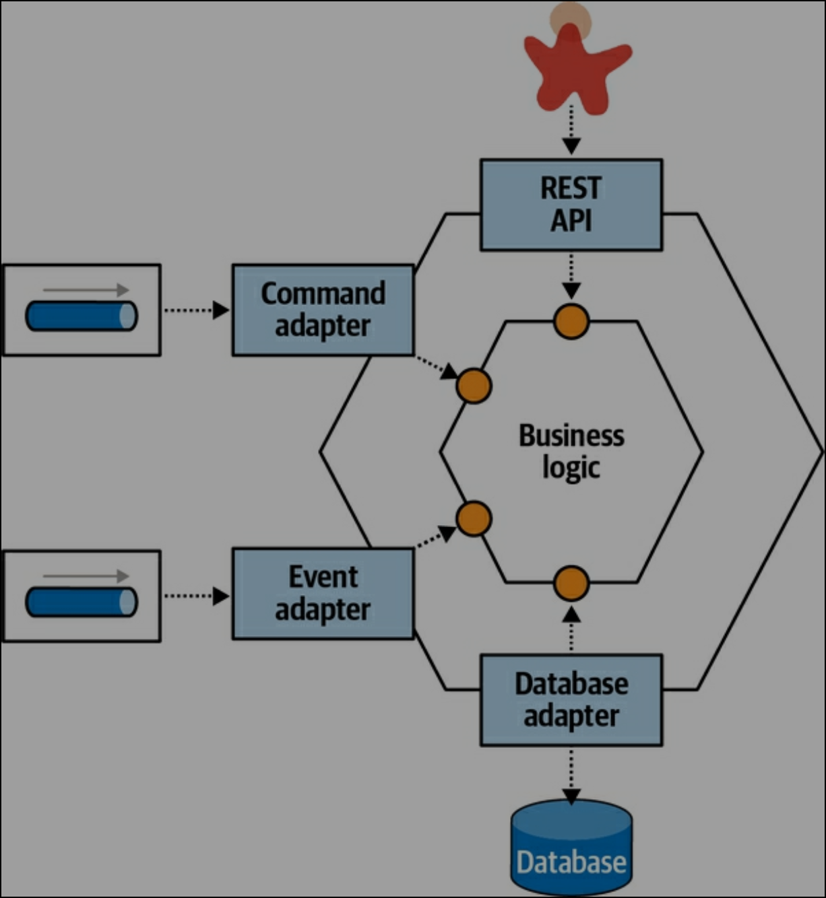

The Sidecar pattern leverages the same concept as hexagonal architecture in that it decouples the domain logic from the technical (infrastructure) logic. For example, consider two microservices, as shown in Figure 8-13.

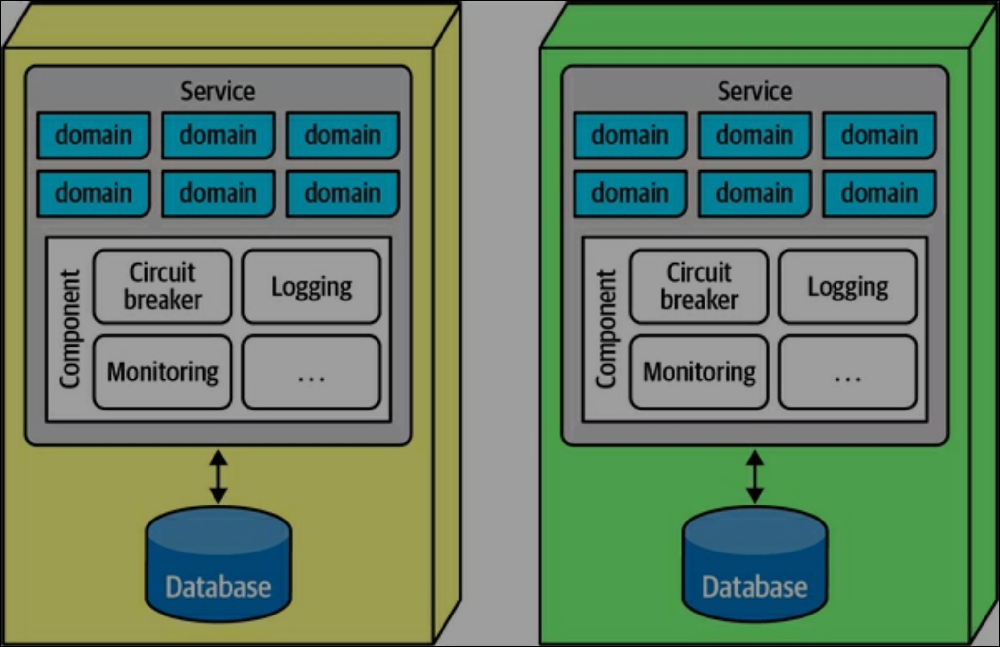

Here, each service includes a split between operational concerns (the larger components toward the bottom of the service) and domain concerns, pictured in the boxes toward the top of the service labeled “domain.” If architects desire consistency in operational capabilities, the separable parts go into a sidecar component, metaphorically named for the sidecar that attaches to motorcycles, whose implementation is either a shared responsibility across teams or managed by a centralized infrastructure group. If architects can assume that every service includes the sidecar, it forms a consistent operational interface across services, typically attached via a service plane, shown in Figure 8-14.

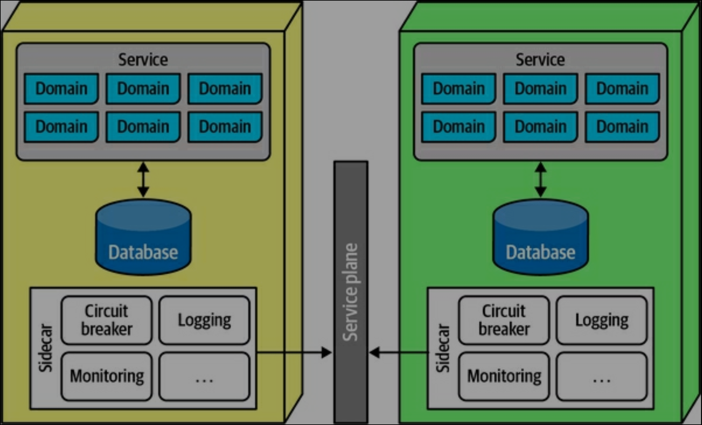

If architects and operations can safely assume that every service includes the sidecar component (governed by fitness functions), it forms a service mesh, illustrated in Figure 8-15. The boxes to the right of each service all interconnect, forming a “mesh.”

Having a mesh allows architects and DevOps to create dashboards, control operational characteristics such as scale, and a host of other capabilities.

The Sidecar pattern allows governance groups like enterprise architects a reasonable restraint over too many polyglot environments: one of the advantages of microservices is a reliance on integration rather than a common platform, allowing teams to choose the correct level of complexity and capabilities on a service-by-service basis. However, as the number of platforms proliferates, unified governance becomes more difficult. Therefore, teams often use the consistency of the service mesh as a driver to support infrastructure and other cross-cutting concerns across multiple heterogeneous platforms. For example, without a service mesh, if enterprise architects want to unify around a common monitoring solution, then teams must build a sidecar per platform that supports that solution.

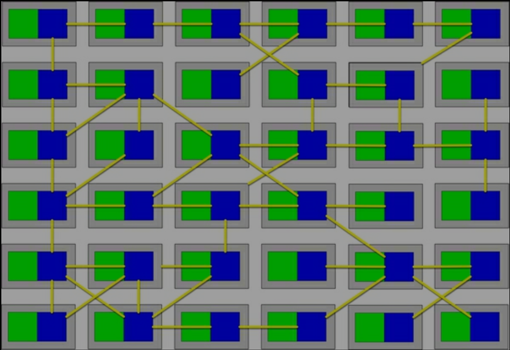

The Sidecar pattern represents not only a way to decouple operational capabilities from domains—it’s an orthogonal reuse pattern to address a specific kind of coupling (see “Orthogonal Coupling”). Often, architectural solutions require several types of coupling, such as our current example of domain versus operational coupling. An orthogonal reuse pattern presents a way to reuse some aspect counter to one or more seams in the architecture. For example, microservices architectures are organized around domains, but operational coupling requires cutting across those domains. A sidecar allows an architect to isolate those concerns in a cross-cutting, but consistent, layer through the architecture.

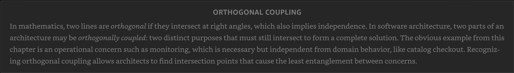

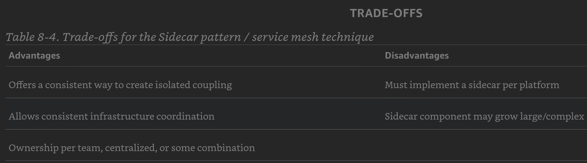

### When to Use

The Sidecar pattern and service mesh offer a clean way to spread some sort of cross-cutting concern across a distributed architecture, and can be used by more than just operational coupling (see Chapter 14). It offers an architectural equivalent to the Decorator Design Pattern from the Gang of Four Design Patterns book (Addison Wesley)—it allows an architect to “decorate” behavior across a distributed architecture independent of the normal connectivity.

## Code Reuse: When DOes It Add Value?

Reuse is one of the most abused abstractions, because the general view in organizations is that reuse represents a laudable goal that teams should strive for. However, failing to evaluate all the trade-offs associated with reuse can lead to serious problems within architecture.

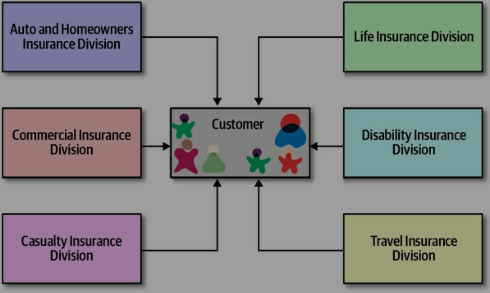

While the picture in Figure 8-17 may seem logical, it’s an architectural disaster for two reasons. First, if all institutional information about a key entity like Customer must reside in a single place, that entity must be complex enough to handle any domain and scenario, making it difficult to use for simple things. Secondly, though, it creates brittleness within the architecture. If every domain that needs customer information must get it from a single place, when that place changes, everything breaks.

What architects failed to realize is that reuse has two important aspects; they got the first one correct: abstraction. The way architects and developers discover candidates for reuse is via abstraction. However, the second consideration is the one that determines utility and value: rate of change.

Internal domain capabilities or quick-changing technical frameworks make terrible coupling targets.

Tip: Reuse is derived via abstraction but operationalized by slow rate of change.

### Reuse via Platforms

However, most agree that the platform is the new target of reuse within organizations, meaning that for each distinguishable domain capability, the organization builds a platform with a well-defined API to hide the implementation details.

Slow rate of change drives this reasoning. As we discuss in Chapter 13, an API can be designed to be quite loosely coupled to callers, allowing for an aggressive internal rate of change of implementation details without breaking the API. This, of course, doesn’t protect the organization from changes to the semantics of the information it must pass between domains, but by careful design of encapsulation and contracts, architects can limit the amount of breaking change and brittleness in integration architecture.
